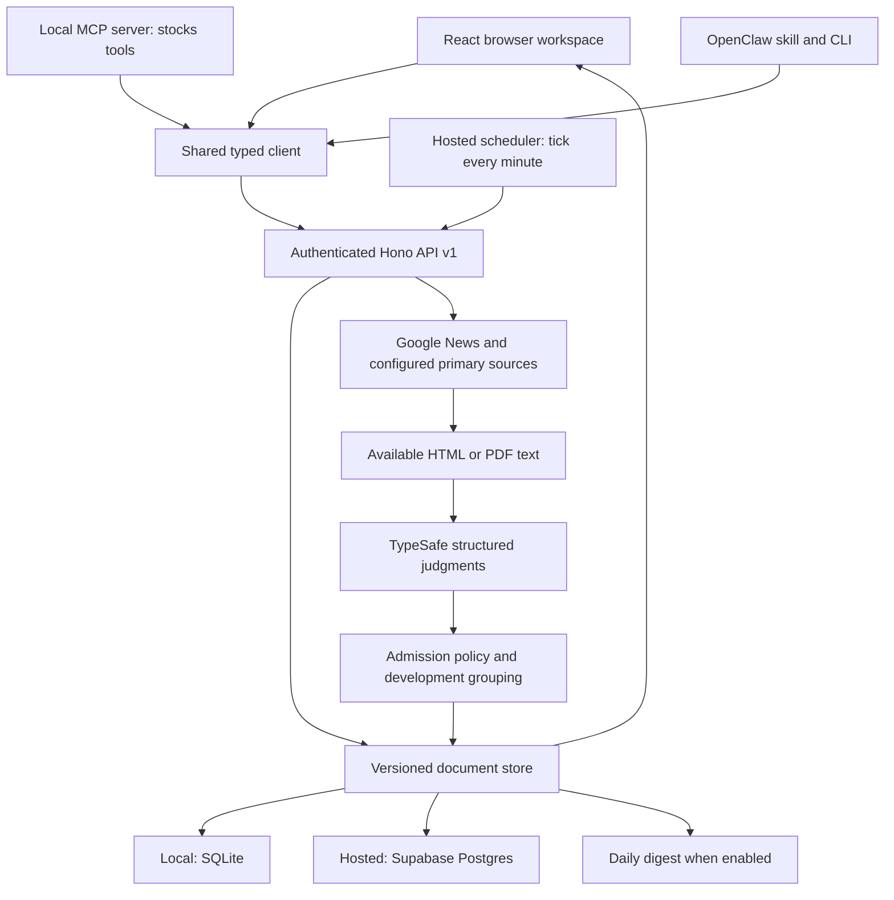

# How Research Desk works

Updated September 22, 2026. This is the technical reference for maintaining the app. **For a plain-language explanation of the whole system, start with [docs/HOW-IT-WORKS.md](docs/HOW-IT-WORKS.md).** Use [README.md](README.md) for setup, [API.md](docs/API.md) for the API contract, [INTEGRATIONS.md](docs/INTEGRATIONS.md) for MCP/OpenClaw, [fundamental-screening-v2.md](docs/fundamental-screening-v2.md) for screening thresholds, and [DEPLOYMENT.md](DEPLOYMENT.md) for deployment. This describes the implemented system, including its limits.

## The purpose

Research Desk is a private company research notebook with scheduled monitoring. You maintain notes, a thesis, watch points, sources, and numerical alert rules. The server discovers articles, retrieves available text, asks TypeSafe for structured judgments, and applies deterministic rules to decide where each development appears. Missing information stays visible as missing.

The software separates three decisions: whether a story concerns the company, whether the underlying development matters, and which available source best represents it. A useful financial release should not disappear merely because its original document is inaccessible or several publishers repeat it.

## Runtime and data flow



The frontend is built with React, TypeScript, and Vite. Cloudflare Pages serves the hosted bundle. Supabase runs the authenticated API and scheduled work. Local development uses the same API and domain modules with a Node.js server and SQLite instead. Local and hosted data are separate.

The local server binds to loopback and checks Host/Origin. Hosted requests validate the Supabase owner session or an expiring, scoped integration token. The scheduler uses a separate server secret. Browser and integration clients do not receive the database service key, TypeSafe key, or email key. Postgres row-level security and service-only functions protect storage writes, version checks, work leases, and AI budget reservations.

## One API, three channels

The website, MCP and OpenClaw call the same versioned API. `client/operations.ts` declares typed operations for research, monitoring configuration, developments, jobs, imports and exports. The official MCP SDK turns these into `stocks_*` tools; the OpenClaw CLI accepts the same arguments. The website uses the shared HTTP transport and preserves its owner-only bulk loading/editor compatibility routes. Domain rules stay in `_shared`; integrations never bypass them through database access.

Company writes use optimistic version checks. Notes can be appended without replacing a whole company; individual watch points, rules and feeds can be changed independently. Development feedback updates all existing duplicate members atomically. Required request keys prevent ordinary retry duplication, and an audit trail distinguishes website, MCP and OpenClaw actions. A crash after a domain write but before its response is recorded is reported as uncertain and requires inspection, rather than an automatic retry.

Integration credentials are shown once, hashed at rest, scoped, expiring and revocable in Settings. Starting paid work has a separate permission. Durable jobs enqueue quickly, expose status and support pause/cancel; the server performs bounded units under leases. The local worker runs while the Node server is running, and hosted jobs advance on scheduler ticks. Completed results survive interruption. The website polls small change metadata every five seconds while visible and retains draft conflict handling when another channel edits research.

## Where to change things

| File or directory | Responsibility |
| --- | --- |
| `src/main.tsx` | Sign-in, navigation, company editor, autosave, settings, imports, monitoring health |
| `src/news-panel.tsx` | News folders, filters, grouped cards, feedback, reader, search controls |
| `src/api.ts` | Browser API requests, session header, timeout and HTTP error handling |
| `client/` | Shared authenticated transport, typed operation catalog and private integration configuration |
| `mcp/`, `bot/`, `openclaw/` | MCP stdio server, Docker setup, OpenClaw CLI and skill |
| `src/integrations-panel.tsx` | Credential administration and durable job history |
| `src/sync.ts` | Version-aware incremental merges and stale batch/run-response protection |
| `src/drafts.ts` | Device draft recovery through IndexedDB |
| `src/news-cache.ts` | Per-device IndexedDB copy of events plus sync cursor (21-day expiry) |
| `src/ui.tsx`, `src/style.css` | Shared form/date helpers and responsive presentation |
| `supabase/functions/_shared/model.ts` | Company/settings schemas, event types, document/store contracts |
| `supabase/functions/_shared/api.ts` | Validated routes and orchestration |
| `supabase/functions/_shared/api-v1.ts` | Scoped versioned API, granular writes, pagination, retry ledger and audit |
| `supabase/functions/_shared/integrations.ts`, `job-queue.ts` | Credential lifecycle and durable API jobs |
| `supabase/functions/_shared/scheduler.ts` | One-minute `tick()`: schedule state, daily/weekly run start, nightly quotes/snapshot/rescreen queue, digest, API jobs |
| `supabase/functions/_shared/news-batch.ts` | Run engine shared by scheduled runs (`news_batch/scheduled`) and manual searches (`news_batch/latest`): bookmarks, back-off, pacing, warnings, pause/resume/cancel |
| `supabase/functions/_shared/fetch-policy.ts` | Google pacing and adaptive slow-down, `ThrottledError`, per-run publisher skip list |
| `supabase/functions/_shared/constants.ts` | Statuses, default settings, `NEWS_SCHEDULE` (run times, per-tick and per-night limits) |
| `supabase/functions/_shared/jobs.ts` | Article processing, history comparison, rescreen, quote monitoring, digest, snapshots |
| `supabase/functions/_shared/news.ts` | Search URLs, text cleanup, displayed news buckets and priority |
| `supabase/functions/_shared/article-content.ts` | Primary discovery, destination checks, redirects, extraction, text cache |
| `supabase/functions/_shared/news-screening.ts` | TypeSafe state, questions, response validation, chunk aggregation |
| `supabase/functions/_shared/screening-policy.ts` | Admission thresholds, explanations, lead-source ranking and grouping |
| `supabase/functions/_shared/event-inbox.ts` | Folder membership, expiration and company filtering |
| `supabase/functions/_shared/engine.ts` | Cadence, financial arithmetic, rule episodes, safe links and formatting |
| `supabase/functions/_shared/providers.ts` | RSS/Atom, provider configuration and market-data adapter |
| `supabase/functions/_shared/importer.ts`, `restore.ts` | Markdown conversion/export and full backup validation |
| `server/store.ts`, `_shared/supabase-store.ts` | SQLite and Supabase implementations of the same store interface |
| `supabase/functions/desk/index.ts` | Cloud authentication, scheduler authentication and CORS |
| `supabase/migrations` | Database schema, indexes, RPCs, private views and constraints |
| `tests` | Policy, retrieval, inbox, queue, storage and API regressions using fixtures |
| `scripts` | Diagnostics, evaluations, backups, disposable previews and performance checks |

A display-only change usually starts in `news-panel.tsx` or `style.css`. A TypeSafe question change starts in `news-screening.ts`; an admission decision starts in `screening-policy.ts`. Avoid re-reading or rewriting unrelated modules for a focused change. Live evaluation scripts can make paid calls; ordinary tests mock providers.

## Records and safe editing

Every stored document has a kind, ID, JSON data, monotonically increasing version, and update time. Companies contain identity, research, watch points, sources, rules, quote history, and monitoring checkpoints. Events contain the article or alert, provenance, publication/discovery dates, screening evidence, grouping information, and reader state.

Other record kinds hold settings, note revisions, import originals, job attempts/runs, daily snapshots, article cache entries and news runs. `news_batch/latest` is the manual search, `news_batch/scheduled` the current or last nightly run, `run/schedule` the scheduler's state and 14-run history, and `run/rescreen-queue` the night's rescreen ids. The database's kind constraint (latest in `202609200006_shared_api.sql`) does not include `screening_cache` or `primary_lookup`. Writes of those derived caches fail silently in the hosted database, so they only take effect locally. New record kinds need a migration. A company research revision and its `newsRevision` are separate from the storage version. Relevant context changes invalidate screening reuse; background price updates do not turn into user research edits.

The store interface supports projected reads: `list(kind, { fields, ids, cluster })` and `get(kind, id, { fields })`. `fields` names dotted data paths; Supabase returns only those JSON paths, and an empty list is an existence check. Projected records are partial and must never be written back. `ids` fetches specific records (50 per request); `cluster` selects a development's members (`id` or `clusterId` equal to the key) for one company.

Company edits update the browser immediately, save a device draft, and are sent after a debounce. Saves include the expected server version and the original base. If another writer changed unrelated fields, the API merges the changes. Competing edits to the same field return a conflict. Background feed checkpoints and alert episodes are excluded from editable-field comparisons and preserved by the server. Changing a rule's meaning resets its trigger episode. Notes/thesis revisions preserve earlier content.

Event actions also update immediately. While a write is pending, the UI disables conflicting actions for that development. A failed save rolls back with a visible error. Review, Save, Useful, Noise, and Undo apply to all stored members of that development, even when some are outside the current filter. An omitted feedback field preserves existing feedback; explicit `null` clears it.

## Scheduled and manual news runs

pg_cron calls `POST /scheduled` every minute; the route runs `tick()` in `scheduler.ts` under a 150-second `scheduler-tick` lease with a ~50-second work budget. Each tick reads `run/schedule` and works through these steps in order, each isolated so one failure does not block the rest:

1. One step of a queued API job (`job-queue.ts`, found by a projected status scan).
2. The digest, until today's is sent or skipped (`digestDate`).
3. The daily snapshot, once per Chicago date (`backupDate`).
4. The scheduled news run: start one if due, otherwise advance the active one by at most `NEWS_SCHEDULE.articlesPerTick` (10) new articles in ≤45 seconds.
5. A running manual batch, with the remaining time.
6. Quote monitoring once per night after 1am (`runMonitor` with `news: false`, 25 companies per tick).
7. Once no scheduled run is active: build the night's rescreen queue from a projected scan (≤300 ids), then work through it 10 at a time. A Google throttle pauses rescreens for 30 minutes.

**When runs start.** The daily run is due once per Chicago date from 1am. It covers daily-cadence companies (Portfolio/Perpetual watch or an explicit daily override), with `since` = min(now − 24 h, previous run start) − 2 h, capped at 7 days. The weekly run is due from Friday 6pm through Saturday, or after 8 days without one. It covers every non-paused company, daily ones first then by name, with `since` = now − 7 days. A daily run within 24 hours of a weekly start is skipped. A run that is still active defers the next one. The first tick after installation records `installedAt` and marks today's daily run done.

**The run engine** (`advanceNewsBatch`, shared by the `scheduled` and `latest` slots with separate leases `scheduled-news-run` and `manual-news-batch`, 300 s):

1. Each company's sources are its primary sources (SEC/IR discovery), then each default Google News feed expanded into one date-bounded search per UTC day covered, then any custom feeds. Scheduled runs derive the days from `since` and filter by the exact cutoff. Manual searches keep their fixed 7-day lookback. Up to 10 items are kept per source.
2. Each pending article gets a projected existence check. A new one is processed with `assumeNew` and a per-slice cached, projected company history (200 items, updated after each save).
3. A small projected `status` read before every step makes pause/cancel prompt. Progress is saved every 5 steps and at the end of the slice (optimistic version; a conflict merges the user's status), so a killed worker repeats at most a few idempotent steps.
4. `ThrottledError` (Google 429/503 on a search, article page or link decode) leaves the step in place and sets `backoffUntil` to 1, 3, 10, 20 or 30 minutes. After 5 consecutive refusals, a search is warned and skipped, and an article is processed with `throttleOk` (recorded as unreadable, retried by rescreen). Other unexpected article errors are retried on two later slices, then warned and skipped.
5. When a scheduled run finishes a company, it updates `lastNewsCheck` (unless a feed failed) and each feed's `lastSuccess`/`error`, and files one health event per failing source.
6. The run saves `skippedHosts` and learned Google `pace` so later slices continue with them.

**Manual Search news** keeps its behaviour: the current company selection becomes a saved batch (one at a time), with up to 10 items per UTC day for 7 days per company plus primary sources, and pause/resume/cancel. The visible page advances it; scheduler ticks also advance it after the scheduled run's share, so closing the browser does not stop it.

Each article also has a 600-second lease shared by every worker, preventing duplicate paid processing. A crashed worker's lease expires, which can delay a retry but not lose work.

## Discovery, retrieval, and the reader

Google News supplies discovery links and snippets. Configured RSS feeds, IR pages, and SEC discovery provide additional primary material. Netflix, Progressive, Zoom, and American Coastal have built-in primary discovery defaults. Other companies can supply their own sources and SEC CIK. Name/ticker ambiguity still requires appropriate company identity and search context.

Retrieval resolves permitted links, validates redirect destinations, and extracts HTML with Readability or text from PDFs. Explicit host configuration governs feeds and primary pages. Public HTTPS publisher retrieval is enabled by default with destination/DNS checks for newly encountered hosts; private/local addresses are rejected. `ALLOW_PUBLIC_ARTICLE_HOSTS=false` restores strict article host configuration.

Google link resolution needs two Google requests: the article page is requested with `hl`/`gl`/`ceid` already added, skipping Google's redirect, then a `batchexecute` link decode. Current article ids embed no publisher URL. `fetch-policy.ts` spaces Google requests within a worker (2 s between searches, 0.6 s between page/decode requests). Each refusal doubles the spacing up to 20 s/10 s; each successful step eases it 5% back toward the base. Google 429/503 raises `ThrottledError`: it is not cached and no event is saved, so the caller retries after backing off. Publisher fetches time out after 8 s, or 10 s for configured/default-list and SEC hosts. While a run is tracking hosts, two consecutive 401/403 responses or timeouts from one publisher skip it for the rest of that run. Reads outside a run (including **Read available text**) never skip.

In September 2026 hosted fetches met widespread Google throttling: about 2,340 of ~2,500 article lookups in two days returned 429/503, while a residential test saw none. Treat Google availability from shared cloud addresses as the main throughput risk.

Text is cached and bounded to 120,000 characters. Content depth records whether full, partial, supplied, snippet, or unavailable text was used. That label describes the available extraction, not a guarantee that every page of a filing was read. Paywalls, CAPTCHA, JavaScript-only content, server blocking, discovery gaps, and extraction failures can prevent access. The publisher link remains available. The app does not bypass access controls.

**Read available text** uses retrieval/cache only. It does not call TypeSafe or change the event's classification, review state, or feedback.

## TypeSafe screening criteria

The active version is **fundamental-v2**. [The detailed implementation guide](docs/fundamental-screening-v2.md) is the source of truth for its flow, thresholds, evidence requirements and validation limits.

Code handles exclusions, retrieval, provenance, source blocks, budgets, cache keys and grouping. TypeSafe answers five separate core questions about identity, significance, attribution, contribution and currentness. Exact evidence selection and applicable quality/context/extraction guards accompany them. The displayed significance mean ranges from 0 to 4; admission uses probability mass over useful levels rather than a mean-score cutoff.

Primary and secondary reading recommendations are distinct from relevant developments. Secondary recaps remain Coverage; weak or missing evidence goes to Needs verification. No headline-only acceptance or broad options/calendar headline veto runs in v2. Long documents require document-level reconciliation rather than selecting the most positive chunk. Article-quality feedback can apply to one source without dismissing the whole development.

Prompts live in `screening-prompts.ts` and `news-screening.ts`. Code gates live in `fundamental-policy.ts`; compatibility, grouping and ranking remain in `screening-policy.ts`. Existing v1 records await bounded rescreening and preserve reader feedback.

## TypeSafe and token use

Long text is split into sections of at most 12,000 bytes, preferring paragraph or sentence boundaries, up to 40 within the article character limit. Two sections are screened concurrently, one request each (15-second timeout). If the collected evidence, qualification and section-context passages fit in 19,000 bytes, one more request reconciles them; otherwise the item goes to verification. This avoids relying only on the beginning of a long filing, but long articles can require multiple model requests. Invalid responses, timeouts, unavailable credentials, and exhausted budgets remain explicit screening/retry states. Measured on 2026-09-22: about 2,450 input tokens per new article on average, or about $0.0001.

Before each request, the server atomically reserves a worst-case cost. It settles the reservation against returned input-token usage. Failed requests can leave a conservative reservation in the ledger. The configured default ceiling is $5/month, capped at $10; the code's current estimate is $0.042 per million input tokens. Provider invoices remain authoritative.

Sixteen million recorded input tokens are plausible across thousands of articles, repeated context, multiple chunks, and retries; they are not the same as sixteen million article words. The monthly ledger includes manual searches, scheduled checks, and re-screening. It cannot by itself attribute all usage to one button click. At 247 companies, the requested default allows up to 17,290 Google News items plus primary sources. Actual supply and deduplication usually lower the count.

Elapsed time is dominated by network waits, not the model. The September 22 profile of the old pipeline found publisher fetches took 60% of the time, Google lookups 20% and TypeSafe 10%. Paced Google requests, back-offs and the 10-articles-per-minute CPU cap mean a weekly sweep takes several hours while costing little. Progress uses completed companies, checked articles, warnings, back-off state and recorded tokens to make this visible.

Retries reuse an unchanged classification when article content, provenance, screening version, and company context still match. (This relies on `screening_cache` records, which the hosted kind constraint currently rejects. In the cloud, a retry of unchanged text is therefore screened, and paid for, again. Adding the kind needs a migration and costs storage.) Identical canonical content can reuse previous judgments. A reused URL with a different title/date is not sufficient evidence that two quarterly releases are the same development. Policy-only display changes can reuse stored judgments without an automatic full paid re-screen.

## Relevant developments, duplicates, and folders

The admission policy combines the model's judgments with source/content depth and user feedback; exact thresholds are in [TypeSafe screening criteria](#typesafe-screening-criteria). Supported primary evidence and substantive secondary reporting can enter Relevant developments. An explicit financial-results headline can qualify through a narrow fallback when the document is unavailable; the UI labels the evidence limitation. Uncertain identity or insufficient evidence generally remains in Needs verification. Noise remains inspectable.

Duplicates are grouped by company and development cluster. The best eligible source leads the card according to `screeningRank`. Additional coverage remains expandable. Grouping does not delete articles. Later updates with new information can remain distinct. Useful overrides screening; Noise suppresses the reader's development until undone.

Inbox holds unsaved, unreviewed events for 30 days after discovery or an explicit return to inbox. Saved has no time limit. History retains reviewed/expired unsaved items. Folders and screening buckets are separate: review status is not a judgment about fundamental importance. Filters operate on the full loaded dataset; the UI renders 50 grouped cards initially and adds 50 at a time.

The digest uses the same current policy/explanations and effective priority, with important developments before ordinary ones. It is prepared in America/Chicago time and sent through Resend only when enabled and configured. Delivery is idempotent for that local day.

## Automatic monitoring and numerical alerts

Owned and perpetual-watch companies default to daily cadence; other active companies default to weekly, with individual overrides. Archived/paused companies are excluded. Since September 22, scheduled **news** comes only from the scheduled runs described above: daily-cadence companies nightly, all active companies weekly. The scheduler calls `runMonitor` for **quotes only**, once per night. A forced per-company monitor (the company's check-now, or a `monitor` API job, including Monitoring health → Run a batch) still checks both quotes and news through the older per-company path (Google `when:10d` feed filtered by the feed cursor). The job queue advances one company per tick. Manual news search does not change company clocks.

Quotes require a configured provider and confirmed instrument mapping. EODHD supplies daily closes; P/E and market capitalization currently require manual observations. Currency, session dates, stale observations, positive P/E, and potential discontinuities are checked in code. Rules include price thresholds, P/E thresholds, and decline from a baseline. A trigger episode suppresses repeats until recovery or a meaningful rule change rearms it. TypeSafe does not compute prices or trigger arithmetic.

## Synchronization and speed

Each device keeps its events and news cursor in IndexedDB (`src/news-cache.ts`, discarded after 21 days). With a cached copy, startup calls `/bootstrap?events=none` and `/news/updates?since=<cursor>`, downloading only changed events. Without one, `/bootstrap` returns inbox and saved events: a projected index is filtered and only those records are read. The first news update then downloads the full history once and caches it. The cache is saved a few seconds after each successful update, never while a feedback write is pending. The update cursor is taken before the read, and filtering includes its boundary. Version-aware merges ignore older records, preserve pending actions, and reuse unchanged arrays. Batch and run responses are ordered by update time, so a delayed progress response cannot undo a newer Pause.

While visible, the page polls `/changes` every 5 seconds. Company or settings changes trigger `/bootstrap?events=none&companiesSince=<previous cursor>`, which returns only changed companies to merge. Event, batch and job changes trigger an incremental news update. A full company reload happens on returning to the tab after 10 minutes. The minute timer fetches only incremental news. Status reads (`readBatchSummary`) project summary fields and omit queues, company lists and, for frequent scheduled-run updates, warnings. Concurrent news refreshes share one pending request. Grouping computes source ranks and group timestamps once; filter/group calculations are memoized. Postgres indexes owner/kind/update time and event discovery time; SQLite indexes kind/update time.

These optimizations reduce repeated network transfers, sorting, rendering, and duplicated work. They do not lower screening thresholds, change the model/prompts, shorten the reading window, or reduce the requested discovery scope.

## Egress and resource budgets

The hosted project runs on Supabase's free plan: **5 GB egress per billing cycle** (the 5th to the 5th), a 500 MB database, and Edge Functions with **2 s CPU and 150 s wall clock per request**. Every byte PostgREST returns counts toward egress, including reads by the Edge Function and the rows `desk_put` returns after each write.

In September 2026 the old five-minute `/scheduled` route used the quota within days. `pg_stat_statements` showed about 1,100 full event listings in 4.7 days, from `rescreenNews` running every five minutes (~15–18 MB each, ~5 GB/day). The same route also read the full daily backup (~660 KB) to test for its existence, and all companies (~470 KB), 288 times a day. Browsers added a full company reload every minute and two full event downloads per page load.

Rules for future changes:

- Timers must not scan full records. Use `fields` projections, `ids`, `cluster`, or `get(..., { fields: [] })` for existence. Keep per-tick work behind small state records (`run/schedule`), and move chores to once per night.
- Find candidates from a projected index, then read full records only for those you process (the digest and inbox follow this).
- Cache per slice what several steps need (company records, company history).
- Clients sync incrementally and keep their own copy; status reads project summary fields.
- After changing server reads, check `pg_stat_statements` call counts and the dashboard's egress chart.

Measured after the change (2026-09-22): an idle tick makes 6 store calls returning about 370 bytes. An end-to-end weekly-style run on 10 real companies (307 checked, 144 new) averaged 15 store calls and about 28 KB per new article. About 40% of that is rows returned by writes; a `desk_put` variant returning only the version would remove it, but needs a migration. The estimated monthly total is 0.7–0.8 GB.

CPU: the same profile measured about 80 ms of processing per article (HTML parsing dominates), so `articlesPerTick` is 10 (~0.8 s). TypeSafe: estimated ~$3/month against the $5 server ceiling (weekly sweeps ~$1.6, daily runs ~$0.3, rescreens ≤$1). Database: about 48 MB used, and about 5 KB per stored article including cache and index.

## Import, backup, and restore

Markdown import first produces a preview with ambiguity/duplicate choices. Original text is retained. Rollback removes untouched imported companies and preserves edited companies. Per-company Markdown export checks HTTP success before downloading.

Full JSON export includes companies, events, note revisions, settings, and import records. Quote history is stored with companies. Hosted daily research snapshots retain companies/research/settings/import originals for 30 days; they are narrower than full exports.

Restore accepts up to 100 MB and 20,000 records, validates the entire file before the first write, rejects inconsistent IDs/invalid rendered shapes, and inserts only missing records. Existing records are skipped. It is not an overwrite/merge tool or a single transaction: a storage failure partway through can leave partial progress, and retry skips already inserted records. Larger archives require a future paged restore path.

## Verification and review results

```powershell
npm run check
npm test
npm run build
npm run benchmark:news
```

The September 22 scheduling and egress change passes 223 tests across 24 files. New checks cover daily/weekly run timing and scope, idle-tick read size, quotes-only nightly monitoring, the rescreen queue and its throttle pause, back-off and retry of rate-limited searches, per-run publisher skipping, the direct Google page request, adaptive pacing, projected/id/cluster store reads, and scheduled-run company bookkeeping. The Supabase projection, id and cluster queries were also verified read-only against the live database (clusters of up to 44 members matched exactly). After deployment, live ticks returned HTTP 200 every minute.

The September 19 review passes 71 tests across eight files, including article retrieval, policy fixtures, inbox/queue controls, rule behavior, concurrent article processing, stale merges, feedback clearing, canonical URL reuse, digest ordering, and restore validation. TypeScript also rejects unused locals/parameters.

The benchmark in [validation/code-review-performance.json](validation/code-review-performance.json) compares old and optimized grouping on 12,000 synthetic articles over 21 warm samples. Measured median grouping time fell from about 41.1 ms to 23.7 ms (about 42% less time, 1.7× speed). Lead sources, coverage membership, and group order matched exactly. This measures in-process grouping, not total scan time or network latency.

Browser checks use disposable data: 30 companies and 4,000 articles. They cover desktop and phone layouts, pagination, Save, Useful/Undo, cancellation, article reading, note autosave/Markdown/revision history, and the keyboard-accessible add-company dialog. A monitoring-table overflow found during these checks was fixed. These checks do not establish that every possible UI state is defect-free.

The backend and frontend were deployed and checked with `scripts/verify-review.ts`. The hosted desk had 247 companies and 4,193 events; the next unchanged news refresh returned zero event records, and the lightweight research refresh omitted events. The existing batch remained paused at 740 checked articles. This verification made no paid AI calls and confirmed that the live site served the current production bundle.

To reproduce the disposable preview, run `npm run preview:review`, then in another PowerShell terminal:

```powershell
$env:REVIEW_API_TARGET='http://127.0.0.1:8788'
$env:VITE_SUPABASE_URL=''
$env:VITE_API_URL='/api'
npx vite --host 127.0.0.1 --port 5174
```

The review API uses in-memory fixtures without TypeSafe credentials. Do not substitute production data or run live evaluation scripts when a fixture test can answer the question.

The requested maximum 5% quality loss is treated conservatively: screening configuration and reading/discovery limits were preserved, and grouping output was checked for exact equivalence. There has not been a new statistical measurement of model recall/precision, so no numerical accuracy guarantee is claimed. Future changes to prompts, thresholds, content limits, or candidate selection should be evaluated against a labeled corpus before deployment.
