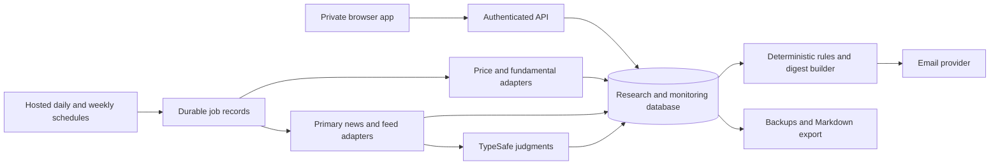

# Stock Monitoring — Product Requirements & Delivery Plan

**Version:** 0.2 · **Status:** Revised draft for your review · **Prepared:** September 17, 2026

**Revision 0.2:** incorporates daily/weekly monitoring tiers, Chicago time, daily email, interaction speed ahead of visual polish, stronger major-news detection requirements, and Supabase/GitHub as existing tools. No financial-data subscription currently exists; worthwhile low-cost services are acceptable within the working budget.

**Product owner:** Nithin Mantena. **Working scope:** a private research and monitoring application for one user. This document proposes the product and implementation sequence; it does not authorize subscriptions, deployment, or migration of the source files.

## 1. Product decision in one page

Build a fast home for companies you have spent meaningful time researching. Capture a company and your thinking with little effort; retain why you passed or kept watching; show current available financial data; bring important price, valuation, and business changes back to your attention.

The primary daily experience is a **company table with a research panel**, supported by a **What changed** inbox and a **daily email digest**. Adding a company, reading a thesis, changing tabs and changing a status must never wait for market data or AI. Interaction speed is a primary product requirement; decorative UI work has no priority over responsiveness, readability and reliability.

Use **TypeSafe to judge relevance**, suggest categories, select evidence, and help find old ideas. Use **data sources to obtain facts**, a database to preserve research, and ordinary code for financial calculations and threshold alerts. TypeSafe is not a replacement for a quote feed or a news source.

### Confirmed requirements

| Decision | Confirmed preference |
| --- | --- |
| Running budget | Up to **$25/month**, accepting coverage gaps |
| Availability | Hosted online; monitoring continues while the computer is off |
| Price frequency | End-of-day data is sufficient |
| Monitoring cadence | **Daily** for current portfolio, perpetual-watchlist and explicitly prioritized companies; **weekly** for other active companies |
| Notifications | Daily email news digest; price and valuation alerts appear there and in the app |
| Timezone | **America/Chicago**, observing CST/CDT automatically |
| Design priority | Extremely fast navigation, search and editing; visual polish is secondary |
| News priority | Avoid missing major developments, even at the cost of reviewing some uncertain items |
| Existing services | Supabase and GitHub are already used for another project; account plans/capacity are not yet verified |
| Financial-data subscription | None currently; open to low-cost services with demonstrated value |
| Source material | Existing investment Markdown and old HTML app inform the design |
| Working process | Review this PRD, incorporate feedback, then implement |

### Recommended defaults for review

- All researched companies remain searchable, including passed and unsupported listings.
- Separate **research status**, **research depth**, **business-quality opinion**, and **monitoring settings**. They answer different questions.
- Preserve your original notes verbatim. Structured fields are optional aids, not a second writeup you must maintain.
- Make price data global where affordable; expose fundamental and news coverage honestly for each company.
- Apply daily monitoring to the most important names and weekly monitoring to the rest. The daily digest includes whichever companies produced new findings; cadence is not a reason to withhold an already discovered major event.
- Begin with 20–30 representative companies for data validation, then 50–100 actively monitored companies for a pilot. Design storage and browsing for at least 2,000 company records.
- The app becomes the editable source of truth after migration. Markdown export keeps the research portable to Obsidian. Automatic two-way Obsidian sync comes later.
- Evaluate data providers before choosing one. No verified package currently establishes comprehensive global quotes, current P/E, market cap, and broad news coverage within the complete $25 budget.

### Most consequential tradeoff

The budget can support a useful research app and selective monitoring. Tiered scheduling reduces requests and processing but does not necessarily reduce a provider's fixed subscription price. Complete global financial/news coverage remains unproven. Missing data must be visible; the product must remain useful without making you fill in a large financial form for every company. Keep $25/month as the working ceiling unless you explicitly revise it; willingness to pay for useful services is not assumed to increase that ceiling.

## 2. What the supplied material tells us

### Investment list

The supplied Markdown is approximately 130 KB and 1,680 lines. It contains 319 top-level bullets, **not 319 verified companies**: some bullets are thesis sections, blank entries, duplicated companies, or lists of multiple businesses. Entity count must be established during migration review.

Your actual workflow includes:

- Two perpetual-watch groups: high-quality/researched and mid-quality or mid-researched.
- Potential ideas, passes with valuation work, and passes without valuation work.
- Companies to revisit after earnings and companies waiting to be entered.
- Sourcing and review dates, company descriptions, detailed theses, pass reasons, external documents, and explicit watch conditions.
- Valuation approaches beyond trailing P/E: forward earnings, free cash flow, owners' earnings, NAV, and target prices.
- A broad international universe, including small companies and less-covered markets. The notes include companies connected to the US, Canada, UK, Australia, Japan, South Africa, Poland, Israel, UAE, Philippines, Malaysia, Vietnam, Ghana, Nigeria, Turkey, and other European markets. These are research references, not verified listing mappings.

Examples shaping the requirements, taken from your notes rather than current market data:

| Existing research pattern | Product implication |
| --- | --- |
| Progressive: revisit at a particular price; monitor autonomous-vehicle risk | Numeric price rule and a separate thesis-risk monitor |
| Auto Partner: watch margins, international expansion, working capital and Inter Cars | Multiple explicit watch points, including a competitor relationship |
| Kingsway: acquisitions, warranty-business sale, NOL monetization | Entity-specific event filtering; generic positive/negative sentiment is insufficient |
| JDC: forward FCF and enterprise-value assumptions | Preserve the valuation basis; do not relabel it as ordinary P/E |
| Libra and Salik: local-currency price targets | Listing, currency, and quote-unit correctness are essential |
| Names repeated in intake and pass sections | Merge mentions carefully without losing status history or rationale |

### Old app: observed behavior and proposed response

These findings come from source inspection, not a measured runtime benchmark.

| Observed implementation | Consequence / risk | New requirement |
| --- | --- | --- |
| Login awaits Google API setup, file lookup, helper-sheet setup, data load and quote refresh before rendering the view; HTML lines 210–221 | External services sit in the opening path | Render stored research first; refresh in the background |
| Quotes use a helper Google Sheet, write GOOGLEFINANCE formulas, wait three seconds, then read cells; lines 356–405 | Fixed latency and an indirect data dependency | Direct provider adapters, scheduled ingestion and cached readings |
| Profile fallback waits two seconds per lookup; lines 408–435; bulk enrichment awaits profiles in a loop | Large imports can take a long time | Save immediately; bounded parallel enrichment with visible progress |
| Each save serializes the complete application data into a Drive file; lines 285–296 | Network overhead and conflicting-write risk | Database writes per record, version checks and recovery |
| Only the first snapshot of a UTC day is stored; lines 613–622 | A later refresh can retain an older snapshot while updating the refresh label | Track observation time, market session and fetch time separately; support corrections |
| Alert evaluation runs during refresh; lines 597–634 | It depends on the browser workflow | Hosted scheduled evaluation |
| Alert de-duplication is per company/rule/day; lines 689–696 | A continuously true rule can repeatedly alert across days | Threshold-crossing state with explicit rearming |
| Credentials and full app settings are in browser storage / the saved data object | Exports and frontend access can expose secrets | Server-side secrets; redact secrets from imports and exports |
| Five broad stages combine purchased/sold and several research meanings | Your actual list is more nuanced | Preserve useful distinctions and historical changes |

**Migration limitation:** the HTML contains application code and an empty default `companies` array. Its real records were loaded from Google Drive `data.json`. The HTML alone cannot recover those records; importing that export is optional if you still have it. The supplied Markdown is sufficient to begin a new research library.

## 3. User needs and success measures

### Jobs to be done

1. After researching a business, save its identity and the useful part of my thinking in seconds.
2. Open the app and immediately see prices, valuation context, and reasons to revisit companies.
3. Find an old idea without remembering its exact name or where I wrote it down.
4. Reconstruct why I passed, including the price, assumptions, concerns and date at the time.
5. Notice developments that affect my thesis without reading a stream of irrelevant headlines.
6. Keep monitoring costs and maintenance effort low enough that I continue using the tool.

### Proposed measurable targets

| Outcome | Acceptance target |
| --- | --- |
| Fast capture | Median ≤15 seconds for a known company; p95 ≤30 seconds in a ten-company user walkthrough, excluding time spent composing notes |
| Fast retrieval | Cold first useful view ≤1.5 seconds target on the agreed reference desktop/network; repeat opening from cache ≤500 ms; warm tabs, cached row opening and filters ≤100 ms p95 and ≤200 ms p99 with 2,000 records |
| Fast search | Local identity/tag search results ≤100 ms p95 after input debounce; keyword results remain usable while optional semantic reranking finishes |
| Reliable writing | Local draft persisted within 300 ms; server acknowledgement normally within 2 seconds, with visible pending/error state |
| Migration integrity | Every original nonempty source block accounted for; no unexplained lost text or silent ambiguous merges |
| Price-rule correctness | All deterministic boundary, missing-data, currency and corporate-action fixtures pass |
| Major-news capture | Proposed release target: ≥95% of independently labeled major events discovered from the agreed pilot-source benchmark within the relevant daily/weekly window; report each uncovered event and denominator |
| Major-news filtering | Proposed release target: ≥98% of retrieved, labeled major events reach the digest or its visible possible-major section; 100% of tested configured official critical-event bypasses survive filtering |
| Useful news | Target ≥75% useful precision in the regular-news section; higher uncertainty is acceptable in a separately labeled possible-major section. Improving precision must not reduce major-event recall below the gate |
| Coverage honesty | Every company exposes price, fundamentals and news coverage independently |
| Scheduled delivery | At least 14 consecutive pilot days of observable scheduled processing, with no duplicate digests and failures surfaced |
| Adoption | During a two-week pilot, at least 80% of newly researched companies are captured here without needing a separate scratch tracker |
| Affordability | Measured recurring services fit the approved budget at pilot volume; one-time/annual payments disclosed separately |

News recall on retrieved articles does **not** measure events absent from our sources. Source discovery, classification and successful delivery are evaluated separately, and end-to-end recall is reported too. The 95% and 98% component targets would imply roughly 93.1% end-to-end recall if they occurred together, not 98% coverage of everything that happened. These are proposed minimum pilot gates, not an acceptable promise to miss the remainder: review every known major miss, remediate it, and show you unresolved gaps before launch. Small test samples cannot establish a general reliability guarantee. No system here can promise never to miss news.

Performance targets apply to a named reference device/browser/network recorded in the test report, with a secondary mobile profile. A cached view may be immediate while its dated values refresh asynchronously; responsiveness must never conceal stale data. External first-load requests have separate loading states and cannot block switching back to already loaded content.

## 4. Information structure

### Company status

| Status | Meaning | Default monitoring proposal |
| --- | --- | --- |
| Inbox | Saved quickly, not organized yet | Weekly enrichment/checks after identity is resolved; unresolved identity remains visible |
| Watchlist | Potential idea worth following or researching | Weekly available prices, relevant news and thesis checks |
| Perpetual watchlist | Researched business worth retaining for years | Daily prices and explicit thesis monitors |
| Pass | Decision retained with rationale | Weekly major-news checks and enabled price/revisit rules; user may mute individual records |
| Owned | Current portfolio company | Daily prices, news and explicit thesis monitors; highest monitoring priority |
| Sold | Previously held | Weekly available data/news and enabled rules, unless promoted or muted |

**Archived** is a visibility/monitoring flag, not a replacement for the research decision. Archived records remain searchable and exportable.

### Daily and weekly monitoring policy

| Activity | Daily tier: Owned, Perpetual watchlist, explicitly prioritized | Weekly tier: other active records |
| --- | --- | --- |
| Prices | Refresh after each relevant trading session using available EOD data | Refresh once per week; use the latest completed session |
| Fundamentals | Check for newly available/revised inputs with the daily cycle; avoid downloading unchanged statements | Check in the weekly cycle; show the underlying fiscal period independently |
| Company-specific news and thesis matching | Check daily, including weekends for news | Check weekly across the entire period since the last successful run |
| Price/valuation alerts | Evaluate newly available eligible observations each daily cycle | Evaluate at the weekly cycle; clearly identify delayed discoveries |
| Already discovered major events | Next daily digest | Next daily digest; do not hold them until the company's next scheduled run |

Proposed weekly cycle: complete before the **Monday 7:00 a.m. Chicago digest**. Keep a per-source successful cursor and fetch with overlap, sufficient history and full pagination; a weekly run must not request only the last 24 hours or the first page of results. Sources retaining less than a week of history require a lightweight more-frequent capture job or must be marked insufficient for weekly monitoring.

For weekly price rules, fetch the intervening EOD history where the provider permits it and evaluate previously unseen closes in order. This can reveal a price threshold crossed earlier in the week even if it recovered before the run. Report the actual observed session, delayed discovery, and whether the condition still holds at the latest observation. If only a latest quote is available, label the rule as weekly-snapshot-only; it cannot establish whether an intervening threshold was crossed. Neither mode detects unobserved intraday crossings.

News appearing only in a company's weekly-polled source may be discovered up to about seven days later, plus source/processing delay. To reduce this gap cheaply, recommend shared daily regulator/exchange/major-event feeds where authorized and available; match those already retrieved items across the library. This is supplementary coverage, not a promise of daily targeted research for every weekly company.

Allow a simple per-company **Daily / Weekly / Paused** override. Marking a company Owned or Perpetual assigns Daily when there is no explicit override; display the resulting schedule when status changes. Existing explicit overrides persist. Feed failures are measured against the feed's cadence, not just whether a price is older than one calendar day. Source lateness and expected weekly refresh are distinct states. Every row/detail exposes last successful check and next scheduled check without adding a settings form to everyday work.

### Independent dimensions

- **Research depth:** quick look, preliminary work, researched, formal pitch, unspecified.
- **Business-quality opinion:** user-defined / unset by default; never inferred as fact from a status.
- **Pass classification:** valuation work done or intended; unvalued / too difficult; unspecified. Separately allow reasons such as expensive, low quality, governance, complexity, or unresolved risk.
- **Organization:** sector/industry, country of listing, countries of operation, tags, source, people and links.
- **Monitoring:** inherited daily/weekly tier or explicit override, enabled numeric rules, enabled news sources, active watch points, last/next successful-cycle information and next review date.

The old “mid-quality or mid-researched” section is intentionally ambiguous. Import its original label and let you split quality from research depth later; do not invent that interpretation.

### Core company record

The only required input is **a company name or an unambiguous listing selection**. Everything else can be added later.

| Group | Fields |
| --- | --- |
| Identity | Stable company ID, display/legal names, aliases, website, one or more listings, selected primary listing, provider IDs, ISIN/CIK when available |
| Listing | Exchange/MIC where known, local ticker, quote currency, quote-unit multiplier, security/share class, timezone, active/delisted/unknown state |
| Research | Original Markdown, optional one-line thesis, risks, why passed, revisit condition, links to pitches/documents |
| Workflow | Status, original imported group, research depth, tags, source, priority, monitoring controls |
| Dates | Found, added to app, last substantive review, notes edited, next review; uncertain imported dates retain their raw text |
| Valuation | Target price/range and currency, target metric/basis, assumptions, effective date, expiry/review date, source |
| Provenance | User-entered/imported/provider-derived/AI-suggested, source reference and timestamps |

Fetching data does not update “last researched.” Viewing a company does not count as a substantive review. Historical assumptions remain dated rather than being overwritten by new quotes.

## 5. Experience and screen requirements

### A. Library: primary working screen

Use a compact table with sticky identity columns and a side panel. Desktop is the primary research experience; mobile supports reading, capture and inbox triage. Prefer ordinary controls, system fonts, a small initial bundle and immediate tab changes. Exclude decorative animations, chart-heavy landing pages, blocking transitions and full-page reloads between company sections. Keyboard focus, contrast and readable density still matter.

Default columns: company, status/group, latest price + currency, price change since chosen baseline, P/E with basis, market cap with currency, distance to target, last reviewed, and unread updates. Allow hiding and reordering columns. Missing values show a reason, never zero.

Saved views: All researched; Perpetual watch; Potential ideas; Passed—valuation; Passed—unvalued; Review due; Near target; Missing coverage. Search covers names, aliases, tickers, tags and notes. Filters and sorting remain active after opening and closing a company.

Keyboard: command/search shortcut, add-company shortcut, arrow navigation, Enter to open, Escape to close. Shortcuts must not interfere with note editing. Do not require dragging cards on a board to organize research.

### B. Quick add

1. Paste a company name, ticker, link, or a note beginning with a company name.
2. Show matching listings with exchange and currency. Offer **Save name only** when identity is uncertain or search is unavailable.
3. Save the record immediately; default to Inbox or the current view's explicit status.
4. Enrich identity and available data in the background. Suggest tags or note sections without replacing the source.
5. If an existing company matches, offer append-to-existing or keep separate; show the current status and the old pass reason.

Optional expanded fields: status, source, note, price target, review date. Bulk paste/import uses the same resolution rules. A parser or model can propose a rule from “tell me if it falls below …,” but the app displays the normalized rule for confirmation before enabling it.

### C. Company panel / full page

Above the fold: identity and listing; status; available price/P/E/cap with as-of labels; your thesis or pass reason; target; next review. The main body opens to notes, not an administrative form.

Tabs or compact sections: Notes, Updates, Valuation & alerts, History. Autosave Markdown notes and preserve versions. Link existing Google Docs, Obsidian notes and company IR pages; full external-document ingestion is not necessary for v1.

“What am I waiting for?” is prominent. Support several short watch points, e.g. “international margins deteriorate,” “warranty business is sold,” or “working capital absorbs more cash.” Each can be enabled/disabled without changing the thesis.

### D. What changed inbox

One place for price/valuation triggers, relevant business events and review reminders. Separate company developments from service-health warnings. Each event shows company, observation/publication time, reason it appeared, source and a direct link.

Actions: reviewed, useful/not useful, snooze, open company, edit rule, mute this topic/source for this company. Acknowledging an alert does not disable its rule. Feedback must never automatically hide all unfavorable news or alter company status.

### E. Daily email

Confirmed timezone: **America/Chicago**, including daylight-saving changes. Proposed send time: **7:00 a.m. Chicago time**, adjustable during setup. Email remains daily regardless of company monitoring tier. The digest covers events discovered since the previous cutoff and states the latest completed market sessions represented; Monday includes the weekly cycle's newly found items. Label older publication/observation dates when discovery was delayed by weekly monitoring.

Content order: major business developments and triggered price/valuation rules; possible major developments needing review; other relevant updates; reviews due; compact coverage/health footer. Show up to ten ordinary items with a clearly labeled overflow link; never hide additional high-priority or possible-major events behind that cap. One event can have multiple sources but occupies one digest entry. A failed critical-company news source appears visibly in the digest, not only on a settings page.

Default: one digest daily, including a short “no new material items from monitored sources” line when appropriate. Offer a skip-empty-days preference. The message must not imply that an empty inbox proves nothing happened.

Links open the private app after authentication. No passwords, provider keys, or complete private theses in email. Recipient and sender-domain setup are deployment inputs, not part of this planning phase.

## 6. Scope and priorities

**P0** is required for the first usable pilot. **P1** improves the workflow after core adoption. **Later** is deliberately deferred.

| ID | Priority | Requirement / completion condition |
| --- | --- | --- |
| CAP-01 | P0 | Quick add saves a name and note without waiting for any external service |
| ID-01 | P0 | Resolve listings with exchange/currency; keep uncertain and unsupported records usable |
| LIB-01 | P0 | Fast table, basic full-text search, filters, saved views and inline status/tag changes |
| NOTE-01 | P0 | Markdown notes, autosave, revision history, pass rationale and original-source preservation |
| ORG-01 | P0 | Status including Owned, original group, research depth, tags, source and date semantics |
| CAD-01 | P0 | Daily/weekly inherited schedules, explicit overrides, catch-up windows and visible last/next checks |
| DATA-01 | P0 | Daily-tier and weekly-tier EOD quote ingestion for the validated coverage set; visible gaps for the remainder |
| DATA-02 | P0 | P/E and market-cap fields with basis/provenance; automated where verified, missing/manual where not |
| RULE-01 | P0 | Absolute price, percentage decline from an explicit baseline and valid P/E threshold rules |
| NEWS-01 | P0 | Reusable primary-source ingestion, daily/weekly retrieval, authorized feeds, deduplication, major-event coverage checks and TypeSafe relevance filtering |
| NEWS-02 | P0 | Explicit watch points, source evidence, uncertain/unprocessed queue and relevance feedback |
| DIG-01 | P0 | Daily Chicago-time digest, possible-major section, idempotent sends, review inbox and delivery-status records |
| IMP-01 | P0 | Reversible Markdown import with preview, ambiguous-item queue and preservation report |
| OPS-01 | P0 | Private login, secrets, budget controls, processing health, backups and tested restore |
| EXP-01 | P0 | Complete research JSON export plus human-readable Markdown; allowed data only |
| IMP-02 | P1 | Import old app `data.json`, if supplied; scrub credentials and preserve field meanings |
| SEARCH-02 | P1 | TypeSafe reranking of retrieved notes and company candidates |
| RULE-02 | P1 | User-defined normalized EPS/owners' earnings/FCF metrics and additional rule templates |
| REVIEW-01 | P1 | Better earnings/review workflow using available calendar data or manual review dates |
| UX-02 | P1 | Multi-company bulk editing and richer mobile capture |
| SYNC-01 | Later | Two-way Obsidian integration with conflict resolution |
| AI-02 | Later | On-demand narrative summaries with a separately chosen generative model and budget |
| COLLAB-01 | Later | Team access, comments, roles and sharing |

Excluded from the first release: trade execution, brokerage integration, portfolio accounting, real-time tick feeds, a general market screener, automatic investment recommendations, automatic DCFs, unattended full-web research for every company, and building a custom global fundamental-data database.

DATA-02 does **not** promise current P/E/cap for every global listing. Accepting that limitation is a product decision to review before implementation, because the user experience must not quietly return to extensive manual data entry.

## 7. Market data: definitions and provider decision

### Non-negotiable metric semantics

- **Price:** selected listing's latest supported regular-session close, with currency, quote unit, market-session date, provider observation timestamp where supplied, and retrieval time. EOD is labeled EOD.
- **P/E:** identify trailing, forward, or user-normalized basis. Default is trailing diluted earnings when trustworthy source data supports that definition. Null, zero, negative or incompatible EPS yields N/M or unavailable, not an attractive negative multiple.
- **Calculated P/E:** only divide compatible price and EPS in code after currency, share-class, ADR ratio, split and fiscal-period checks. Label it calculated and expose the denominator's date. Never let TypeSafe calculate the ratio.
- **Market cap:** prefer provider company-level cap with its currency and as-of time. A price-times-shares calculation is allowed only with compatible shares/date/units; do not double-count dual listings or apply one share class's price to unrelated classes.
- **Change since added/reviewed:** use a known market observation baseline. A source-note date is not proof that we have a price for that date. Offer first observed close or verified historical close and label the choice.
- **Currency:** show native values by default. Optional USD comparison uses a dated FX source. Listing country and operating countries are separate.
- **Corporate actions:** percentage comparisons use a defined split-adjusted price series; price targets must be adjusted for confirmed splits or paused for review. Dividend-adjusted total return is a different measure and must not silently replace price change.
- **Freshness:** distinguish stale, market closed, no recent trade, unsupported, pending and provider failure. Quote freshness and fundamental-period freshness are independent.

### Shortlist based on current official documentation

| Candidate | Verified advertised position | Implication for this app |
| --- | --- | --- |
| EODHD | Global EOD package $19.99/month; fundamentals $59.99/month; all-in-one $99.99/month on its personal-plan page | Candidate for global price coverage, not evidence that $19.99 includes the required fundamentals/news. Validate exact listing and endpoint coverage |
| Financial Modeling Prep | Free Basic advertises 250 calls/day and EOD/reference data; Starter $19/month **billed annually**, US coverage; Premium adds UK/Canada; Ultimate advertises global coverage | Candidate for a narrower/free baseline or a new paid plan if justified. Do not equate the annualized $19 figure with a $19 monthly subscription |
| Company IR / authorized RSS / regulator feeds | Source-specific public material; SEC provides submissions and XBRL APIs without API keys | Useful primary-news inputs. Neither global completeness nor easy universal fundamentals extraction follows from this |

Sources: [EODHD pricing](https://eodhd.com/pricing), [FMP pricing and plan scope](https://site.financialmodelingprep.com/developer/docs/pricing), [SEC API documentation](https://www.sec.gov/search-filings/edgar-application-programming-interfaces). Prices are vendor listings checked during planning, before tax; coverage and account entitlements remain untested.

EODHD separates personal and commercial licensing, including professional usage. FMP also identifies display/licensing conditions. Determine the permitted plan for the intended use before committing the budget. Single-user access alone does not establish eligibility for a personal plan. [EODHD usage definitions](https://eodhd.com/financial-apis/commercial-vs-personal-license-use)

### Phase-zero provider test

Select 20–30 companies spanning the actual list, including Progressive, WOSG, Jumbo Interactive, Auto Partner, JDC, Libra, Salik, Argent, Philippine Seven, FPT Digital Retail, an OTC company and a Nigerian company. Resolve their exact listings first; the names are test candidates, not provider-confirmed symbols.

For each, record listing match, local currency/units, available closing price/date, P/E basis/period, market cap currency/date, primary news source, actual endpoint entitlement, request cost, permitted use and failures. Compare a sample of values against dated company/exchange disclosures. Include a loss-maker, dual listing, split, suspended/delisted security and sparse-news company.

**Decision gate:** publish the coverage matrix and total budget before locking the provider. Proposed pilot goals are price coverage for at least 90% of the selected high-priority pilot set and a usable primary news source for at least 80%; P/E and market-cap availability are reported explicitly rather than assumed. Adjust the pilot set or targets with you if the source test fails; do not hide failures by changing the denominator.

### Budget-compatible selection policy

1. There is no existing financial-data subscription to reuse. Evaluate worthwhile low-cost services alongside authorized free options; do not optimize only for zero subscription cost at the expense of missed major events.
2. Test actual quote, fundamental and news coverage under the daily/weekly schedule and show the exact unsupported set.
3. If global prices deliver the best value, consider the $19.99 EOD package only if usage eligibility, required endpoints and free-hosting performance all check out.
4. If fundamentals remain unavailable, retain manual values/assumptions with dates, plus direct research links. Do not require manually maintaining all companies' EPS as the default workflow.
5. If this falls short of what makes the app useful, revisit coverage or budget before a large implementation. Unofficial quote scraping is not a dependable baseline.

## 8. Price and valuation alert behavior

Initial rule types:

| Rule | Explicit inputs |
| --- | --- |
| Price at/below or at/above X | Listing, currency/units, operator, target |
| Down X% from a baseline | Baseline type/date/observation, split-adjustment policy, percentage |
| P/E at/below X | Earnings basis, valid denominator, maximum permitted age |
| Near target | Specific target price and an explicitly displayed distance formula |

Company rules are sufficient for P0. P1 adds reusable rules across saved groups, where each company's currency and valuation basis still have to be valid.

**State machine:** newly enabled → waiting for valid data → armed → triggered → acknowledged/snoozed → rearmed when the condition clears. Acknowledgement affects the inbox, not market-rule state. A rule created while already satisfied emits one “already within threshold” event. It does not fabricate a crossing time.

- Evaluate once per new or corrected eligible observation, not on every page view.
- Preserve rule version, triggering values, exact comparison, source and evaluated time in the event.
- Use an idempotency key based on rule version, company/listing and trigger episode.
- Use a small explicit hysteresis/rearm setting to avoid oscillation; proposed starting points are 1% above a downward price threshold and 0.25 turns above a downward P/E threshold, subject to review.
- Never treat unavailable data as zero or as a cleared condition. Stale inputs pause evaluation and explain why.
- After an outage, report first observed satisfaction after the gap; do not claim knowledge of missed intraday crossings.
- For weekly rules, preserve the observed crossing session when intervening daily history is available, otherwise describe only what the latest weekly snapshot establishes. Weekly scheduling is an accepted latency, not permission to invent unseen price history.
- If a provider restates an observation, record a correction and avoid duplicate or misleading alerts.
- If price and EPS change together, show their respective changes where valid; a P/E move is not automatically a stock-price decline.
- Notes, AI output and imported text can propose rules but cannot silently activate them.

## 9. News monitoring and the TypeSafe pipeline

### What counts as relevant

Materiality means potential relevance to the business, valuation assumptions or an explicit watch point. Examples: earnings/guidance changes, a significant acquisition/disposal, capital allocation, dilution, a management change, regulation, contract wins/losses, solvency or financing concerns, and a development affecting a named risk.

Suppress repeated syndicated coverage, routine price recaps, generic listicles, irrelevant ticker/name matches, and unchanged stories. Sentiment is optional context, never the primary alert criterion.

**Priority: avoid suppressing major developments.** Ordinary news may be filtered aggressively after validation; uncertain potentially major news receives a visible review path. A development need not match a prewritten concern to matter: retain a general major-event check alongside personalized watch points so unexpected acquisitions, fraud allegations, solvency issues or management changes are not excluded just because you did not predict them.

### How personalized concerns work

You write a concern in plain language, for example: “I am worried that Auto Partner's international expansion will hurt margins or tie up too much cash.” Store your original wording and, after review, turn it into separately answerable watch points such as international profitability and working-capital investment. The app must not replace the original concern with an AI paraphrase without acceptance.

A single free-text concern must work immediately; splitting it into several watch points is optional refinement, not a required setup form. Reuse explicit question templates around the user's own text. Selecting source spans and applying labels needs no generative paraphraser; any later generated rewrite is a separate optional feature.

For each new candidate article/filing, supply the relevant excerpts, company identity, evidence date, and current watch points. Ask several independent questions in one TypeSafe request. A watch point stores optional related entities/topics, date it became active, evidence expectations and examples of what would or would not count. Candidate retrieval includes confirmed competitors, regulators and sector topics when the concern requires them; matching the stock's own name alone would miss some indirect threats.

| Illustrative incoming evidence; not current news | Expected treatment |
| --- | --- |
| The company reports lower international margins and inventory growing faster than sales | Match both watch points; select supporting passages; any numerical changes are calculated and validated in code |
| A competitor raises prices or changes its distribution strategy | Potentially relevant indirect evidence; identify the related entity and avoid presenting it as a proven company outcome |
| The company reports stronger international profitability | Surface evidence that challenges/reduces the concern as well as evidence supporting it |
| An article repeats an old expansion announcement | Link to the existing event; alert again only if it adds a material new fact |
| A possible takeover appears, unrelated to the named concerns | Surface through the general major-event check |
| Only an ambiguous headline is accessible | Flag possible relevance/evidence gap rather than claiming the concern is confirmed |

Separate **relevance**, **evidence direction** (supports the concern / challenges it / mixed / unclear), **materiality**, and **evidence sufficiency**. A relevant article is not proof that the thesis is broken. Multi-period trends require actual prior evidence supplied to the evaluation; a model cannot infer monitoring history from a headline. A compact, dated evidence timeline enables later comparisons without resending the full research archive.

TypeSafe's documented model evaluates multiple questions against shared state in parallel and currently lists $0.042 per million input tokens, with output free. A hypothetical 1,000 article-company evaluations at 4,000 billed input tokens each—including all watch-point questions—costs **$0.168, about 17 cents**, for that model pass. At 10,000 such evaluations it is **$1.68**. Retrieval, extraction, retries, extra passes and optional text generation are additional. [TypeSafe model documentation](https://docs.typesafe.ai/models)

The vendor reports roughly 70–500 ms for its example request workloads; this is not a measured guarantee for our international sources, longer documents or hosted region. Our feasibility test will measure actual median/p95 latency and billing on realistic watch-point inputs. These evaluations run in the background, so their latency never determines how fast a company panel or tab opens. [TypeSafe latency claim](https://typesafe.ai/blog/introducing-system-one-models-and-jev)

### Retrieval comes first

Maintain a per-company source registry: official IR feed/page, regulator filings where supported, permitted publisher feeds, and optionally a paid news API within budget. Reuse a source fetch when it serves multiple companies. Capture published time, first-seen time, URL, publisher, source language and available content depth.

For each Owned/Perpetual company, aim for both an official company/exchange/regulator path and an independent reputable news path, where available within budget. List a single-source or uncovered company explicitly. Fetch and interpret ordinary company-specific material according to its daily/weekly tier; inspect available shared major-event feeds daily. A low-cost news subscription may be a better use of budget than richer financial ratios if it demonstrably closes important coverage gaps; phase zero compares that tradeoff.

Maintain publication/discovery watermarks, backfill after outages, paginate the entire interval, watch for silent empty-feed failures and preserve corrected/retracted stories. A source outage on an important company creates a monitoring warning. Check completeness against known announcements periodically; an HTTP 200 alone is not proof that all events were collected. Weekly-source lookbacks must cover all days since the last successful check and never silently truncate to a quota-limited first page.

Start with RSS/Atom, structured APIs and a small number of stable permitted IR connectors. Sites requiring login, paywall circumvention, heavy browser automation or PDFs without usable text are not silently treated as covered. Record “headline only,” “attachment unread,” “source unavailable” or “manual review needed.” Adding a new company should suggest sources where possible, with gaps collected into one setup queue.

### Processing sequence

1. **Fetch:** scheduled source jobs with cursor/watermark, bounded pagination and overlap to catch late arrivals.
2. **Normalize:** canonical URLs, timestamps, language, source IDs and content hashes; retain source evidence within permitted retention rules.
3. **Deduplicate:** exact IDs/hashes first, then candidate event clustering by company, topic and time. Do not merge an event reversal into its original announcement.
4. **Candidate matching:** provider security IDs and confirmed aliases first; otherwise retrieve a short set of possible companies using names and context. Never score every article against the entire library.
5. **TypeSafe evaluation:** ask independent questions over the same limited state in one request. Include relevant company identity, article evidence and selected watch points.
6. **Policy:** code decides high-priority inbox, ordinary digest, uncertain review or suppressed item using measured thresholds and source quality.
7. **Evidence card:** display source headline/link, a selected supporting passage and a templated reason such as “matches your warranty-business sale watch point.”
8. **Delivery:** persist the event once, then include it in the next digest using a delivery ledger.

### Proposed TypeSafe judgments

| Judgment | Primitive / interpretation | Application response |
| --- | --- | --- |
| Does this concern the identified company? | Noul, probability of yes | Resolve or queue uncertain identity |
| Does this report a new substantive development rather than repeat an old one? | Noul with old-event context where available | Prevent repeated notification |
| Which event category best describes it? | Choice, including other/unclear | Group updates and explain routing |
| How consequential is it to this business? | Score with concrete levels: routine; potentially relevant; changes an important assumption; major change requiring review | Rank for attention; not a stock-return prediction |
| Is it relevant to watch point A/B/C? | Independent Noul per watch point | Connect the event to your own research without conflating relevance with proof |
| What direction does its evidence have for each applicable concern? | Choice: supports the concern, challenges it, mixed, unclear; state the premise explicitly | Present both confirming and disconfirming evidence; ignore the answer if relevance is absent |
| Is the evidence sufficient for the proposed label? | Noul | Route incomplete evidence for review |
| Which supplied passage supports the label? | Choice over extracted passage IDs plus none | Select a verbatim source span; never invent a quotation |

Use separate questions for multiple event labels when several can coexist. Choice confidence measures distribution concentration, and Noul is a yes/no probability; neither is a guarantee of factual correctness. The implementation must keep these distinct. [TypeSafe Noul](https://docs.typesafe.ai/primitives/noul), [TypeSafe Score](https://docs.typesafe.ai/primitives/score)

A second call is appropriate only when the first result determines what evidence to fetch or which context to inspect. Do not multiply requests for independent questions already answerable from the same article.

### Important safeguards and limits

- TypeSafe classifies supplied text. It does not browse the web, provide missing financial facts, or write a narrative investment analysis.
- Use code for math, date comparisons, eligibility, budget enforcement and persistence. The vendor documents limitations with arithmetic, dates, distracting context and adversarial text. [Jev limitations](https://docs.typesafe.ai/model-jaggedness/jev-1.13)
- Start with precise prompts and compact state. Include “not enough information” where applicable; validate response schemas and enforce logical consistency in code.
- News is untrusted content. It cannot change system instructions, access secrets, call tools, change rules, or send arbitrary messages.
- Known significant official event categories, such as a confirmed takeover announcement or trading halt from a verified source, bypass AI suppression and enter review. Their exact source/type mappings are explicit configuration.
- Uncertain potentially major cases enter the daily email's possible-major section, not just a hidden review queue. AI outages leave items queued; high-priority official events can be delivered as unclassified. Do not suppress a concerning official announcement solely because the model is unsure.
- Classify source-language text only after language-specific evaluation. Do not silently filter unsupported languages; translation is a separately budgeted extension.
- Store model version, prompt/policy versions and user feedback. Pin an evaluated model version for production and rerun the evaluation before upgrades.
- Cache classifications by content, company context, watch-point version, model and prompt version. A revised thesis invalidates only relevant cached judgments.

### Semantic search

P0 keyword/full-text search must work with TypeSafe unavailable. P1 retrieves a shortlist from local notes using full-text/aliases/tags, then uses TypeSafe to rerank it. If the shortlist has no useful candidates, broaden retrieval or say so; reranking cannot discover records that were never retrieved. Evaluate synonyms and conceptual queries before promising semantic recall. [TypeSafe reranking pattern](https://docs.typesafe.ai/cookbooks/rerank_typesafe)

## 10. Data migration and preservation

### Markdown import

1. Preserve the original file and compute a checksum; ingest a copy only after implementation approval.
2. Parse headings, indentation, lists, links and source line spans. Store original text separately from normalized fields.
3. Detect candidate company blocks. Use rules first; TypeSafe may classify ambiguous blocks or select among listing candidates. No silent deletion of unmatched text.
4. Preview records with original group, proposed status, candidate listing, notes and uncertainty flags.
5. Offer accept-all for unambiguous structural mappings and a compact review queue for the rest.
6. Resolve duplicates by company/security identity, not name alone. Preserve all dated notes and source sections. “Porsche and Volkswagen” is not automatically one company.
7. Keep orphan paragraphs and unclear bullets in an import-review collection until attached or explicitly dismissed.
8. Apply the import as an identified batch; support rollback of that batch without removing later user changes.
9. Produce a reconciliation report: source blocks, matched blocks, unresolved blocks, proposed entities, accepted records, merges and dates requiring confirmation.

### Proposed section mapping

| Source section | Proposed destination |
| --- | --- |
| Earnings calls / companies to rereview | Review tasks attached to matched companies; Inbox records if missing |
| Companies to add | Inbox; duplicates become additional source references |
| Perpetual—high-quality/researched | Perpetual status plus preserved source group; depth/quality suggestions remain reviewable |
| Perpetual—mid-quality or mid-researched | Perpetual status plus exact original group; depth/quality unspecified until confirmed |
| Potential ideas | Watchlist |
| Pass—valued / want to value | Pass plus exact source group; do not mark every entry “valuation completed” |
| Pass—un-valued | Pass plus unvalued group |

Dates embedded in titles are not automatically “date found” or “date passed.” Preserve raw meaning, distinguish explicit from inferred dates, and review ambiguous formats. Numbers in old notes remain historical assertions; they must not become current quotes or live alert thresholds without review.

### Optional legacy JSON import

If the old `data.json` becomes available, import company IDs, notes, tags, sources, stage history and snapshots with a preview. Discard access tokens/API keys from research exports and migration payloads. Treat old daily timestamps and metric bases as potentially incomplete; flag them before using as alert baselines. Keep purchased/sold records unresolved if the original combined stage cannot distinguish them.

### Portability

Export one Markdown file per company with stable IDs and readable frontmatter, an index, and JSON for rules/history/settings without secrets. Market/news content must respect source licensing. App records are authoritative after cutover; exported notes are snapshots, so editing them does not silently overwrite app notes.

## 11. Proposed architecture

Use a small TypeScript application with a static React interface, a server API, a relational database and hosted jobs. Prefer one deployment platform for the pilot. Avoid introducing a large agent framework or a vector database before the retrieval tests justify it.

**Preferred candidate, given your existing tools:** a private GitHub repository for code/migrations; a static React app on an inexpensive static host; **Supabase Postgres + Auth** for persistent data and login, with **Supabase Cron + bounded Edge Function jobs** for data/news processing. Use a transactional email service for the daily digest. Keep provider keys server-side and enforce database ownership with row-level security. GitHub is for version control and delivery, not the production research database or a timing-critical monitoring scheduler.

Prefer a separate Supabase project for isolation. An existing account is useful, but do not assume a new project is free or modify the other project's schema, authentication, jobs or billing. Confirm the current plan, available project slot and incremental cost during implementation setup. Supabase is a strong fit, not mandatory: retain Cloudflare Workers/D1/Cron as an alternative if its actual cost and uptime properties fit better.

Supabase currently advertises a free tier with a 500 MB database, up to two active projects, inactivity pausing, and no automatic backups. Pro starts at $25/month, and additional projects on paid plans start at $10/month. A new standalone Pro subscription consumes the whole working budget before data or TypeSafe. Reusing an account does not eliminate project compute charges. Test the real scheduler/availability behavior and budget backups explicitly; do not assume scheduled traffic guarantees exemption from pausing. [Supabase pricing](https://supabase.com/pricing)

Supabase Cron can invoke SQL/database functions or HTTP/Edge Functions and records run status. Use it to dispatch/check small durable jobs, not a single unbounded global scrape. Edge Functions have execution limits, so persist progress, bound fetch/parse workloads and retry safely. An externally hosted health check should detect a failed or paused scheduler. These are candidate designs awaiting the phase-zero test, not a deployed system. [Supabase Cron](https://supabase.com/docs/guides/cron), [Edge Function limits](https://supabase.com/docs/guides/functions/limits)

### Service boundaries

| Component | Responsibility |
| --- | --- |
| Frontend | Table, notes, quick add, inbox, local draft recovery and cached reading |
| API | Authenticate, validate, authorize, persist record changes and expose coverage |
| Provider adapters | Search identity, get quote/fundamental observations, expose supported capabilities and source errors |
| Source collectors | Fetch allowed source material incrementally; maintain source health |
| TypeSafe adapter | Versioned requests, retry policy, usage metering, caching and schema validation |
| Rule engine | Numeric calculations and condition transitions using eligible observations |
| Digest service | Stable event selection, cutoff, templated email and send ledger |
| Operations | Jobs, budgets, backup/restore, coverage and failure reporting |

Suggested API groups: companies/listings; notes/revisions; saved views; observations/coverage; monitor rules; events/feedback; imports/exports; account/settings. Mutations carry idempotency keys where retries could duplicate data and record versions where concurrent edits can conflict.

### Minimum persistent entities

`Company`, `Listing`, `ProviderMapping`, `ResearchNote`, `NoteRevision`, `StatusHistory`, `Tag`, `SourceReference`, `ValuationAssumption`, `PriceObservation`, `FundamentalObservation`, `WatchPoint`, `AlertRule`, `AlertState`, `SourceSubscription`, `NewsItem`, `CompanyEvent`, `EventEvidence`, `Classification`, `Feedback`, `Digest`, `DeliveryAttempt`, `ImportBatch`, `ImportBlock`, `Job`, `UsageLedger`, `AccountSettings`.

Important constraints: stable IDs independent of tickers; unique provider/listing mapping; field-level provenance; separate observation and fetch times; immutable trigger evidence; unique digest per recipient/Chicago local date; versioned notes and rules; per-company monitoring tier/override; per-source successful cursor and next run. All queries are scoped to the authorized account even in a one-user release. Supabase privileged/service credentials must never reach the client; test row-level policies on every exposed table and function.

### Fast-path behavior

Serve the last known database state immediately. A user edit updates local state optimistically and persists asynchronously; show unsaved/pending states clearly and restore local drafts after reload. Do not place quote calls or TypeSafe calls in the critical path of saving a company or editing a note.

Use indexed/paginated queries and render only visible table rows when necessary. Persisted client caches contain only what is needed and are cleared on logout. Full offline multi-device editing is deferred; a connection failure retains a local draft and prevents silent conflict overwrites.

For near-instant interactions, keep list metadata and already opened company sections in memory, prefetch likely next details, preserve mounted tab state where useful and apply local sorting/filtering to loaded data. Request only the fields needed for the active screen; move long-note loading and semantic ranking off the interaction path. Use background refresh with dated cached values. Normal tab switches must not cause fresh authentication, a full app reload, a database round trip, or an AI request before content can appear. Measure actual click-to-content timing; framework/hosting choice alone does not establish speed.

### Hosted job behavior

- Schedule market/source tasks according to the daily and weekly policies. For daily names, fetch EOD after expected market close/provider availability; for weekly names, refresh the latest close and any supported intervening history in the weekly cycle. Retry late data and label the actual session received.
- Persist cursors, retries, next-run time and last success. Use exponential backoff, jitter, per-source limits and a dead-letter/review state.
- Job claiming uses leases and recovery of interrupted work. Whether dispatched by a database-backed queue or a hosted message queue, delivery can repeat: every consumer is idempotent. Database jobs remain the durable record so queue expiry or function termination does not lose work.
- Digest scheduling uses America/Chicago and one send per local date, including daylight saving. The proposed 7:00 a.m. time must not be hardcoded to a fixed UTC offset. Include spring/fall DST tests and Monday weekly-cycle completion checks.
- Overlap source fetch windows, deduplicate by stable IDs, and distinguish publication time from discovery time for late articles.
- A completed fetch with no items differs from a failed fetch. Health checks track both.

If the Cloudflare alternative is selected, its free Workers tier has strict CPU/subrequest limits; a single cron must not parse or process hundreds of feeds. Queues also have free-tier operation and retention limits. Validate small-job performance and the full daily/weekly volume before relying on free hosting. A $5/month paid Workers plan is an alternative only if the complete budget is rebalanced. [Workers limits](https://developers.cloudflare.com/workers/platform/limits/), [Workers pricing](https://developers.cloudflare.com/workers/platform/pricing/), [Queue pricing](https://developers.cloudflare.com/queues/platform/pricing/)

## 12. Budget and cost controls

### TypeSafe economics

TypeSafe currently advertises **$0.042 per million input tokens with free output tokens**. This is a planning input, not a permanent price guarantee. [TypeSafe published pricing](https://typesafe.ai/blog/introducing-system-one-models-and-jev)

Planning formula:

`monthly classification cost = processed article-company pairs/day × billed input tokens/pair × days × $0.042 / 1,000,000`

Example scenarios at **2,000 total billed input tokens per pair**, including question/context overhead:

| Pairs/day | Monthly input tokens, 30 days | Model cost |
| ---: | ---: | ---: |
| 100 | 6 million | $0.252 |
| 500 | 30 million | $1.26 |
| 1,500 | 90 million | $3.78 |

These examples exclude retries, second-stage calls, imports and semantic search. Count article-company pairs, not just unique articles. Measure returned API usage and compare it with billing; do not multiply independent questions by a guessed flat per-call price.

### Effect of the monitoring tiers

Illustration, not your verified company count: with **50 daily names and 250 weekly names**, a five-session week requires approximately `50 × 5 + 250 = 500` company price refreshes versus `300 × 5 = 1,500` if all were daily—a roughly **67% reduction** before batch endpoints, history retrieval and retries. For calendar-day company-specific news polling, the corresponding schedule is `50 × 7 + 250 = 600` checks versus 2,100, roughly **71% fewer**. Shared feeds may reduce fetches further. These counts are scheduling units, not guaranteed provider billable calls.

Weekly news checks still read the full accumulated week. They reduce polling overhead, but do not reduce model processing sevenfold when the same articles still need evaluation. A fixed data subscription also costs the same regardless of polling frequency. The biggest TypeSafe savings come from deduplication, compact state, shared questions and caching.

### Budget envelopes

| Cost | Free-source pilot | Conditional global-price route |
| --- | ---: | ---: |
| Market-data subscription | $0 | $19.99 |
| Hosting / database / jobs | $0–5 allocation; validate Supabase or alternative | $0 incremental target; free-tier feasibility required |
| TypeSafe | $2 hard allocation | $2 hard allocation |
| Email service | $0 at pilot volume | $0 at pilot volume |
| Domain / backups / tax / contingency | Remaining budget; actual quotes required | $3.01 remaining total |
| Coverage | Narrower and explicitly tested | Broader EOD prices; fundamentals/news still partial |

The conditional route fits only if taxes, domain needs, backups, usage eligibility and free-tier runtime leave the total within $25. **$19.99 data + $5 hosting already equals $24.99 before AI or other costs**, so those two paid choices are not an acceptable default together. A paid Supabase project must be costed separately using the actual account plan; it is not included at zero just because you use Supabase elsewhere. No annual subscription or paid upgrade is assumed. Phase zero should compare a price-focused package with a news-focused allocation, since avoiding missed major news is a stated priority.

Resend's free tier currently advertises 3,000 emails/month and 100/day, ample for a one-user daily digest if sender setup is satisfied. Measure database storage/egress and job usage on whichever backend is chosen. D1's free allocation is relevant only to the Cloudflare alternative. [Resend pricing](https://resend.com/pricing), [D1 pricing](https://developers.cloudflare.com/d1/platform/pricing/)

### Enforcement

- Reserve fixed fees before assigning variable budgets. Track requests, tokens, source jobs, database usage and email sends.
- Warn at 70% and 90% of each allocation. At the limit, pause lower-priority AI/enrichment jobs and surface the backlog; do not silently buy more capacity.
- Keep note capture, research retrieval and eligible deterministic alerts working if TypeSafe is unavailable or capped.
- Do not clear queued news or label it irrelevant because budget ran out. Reserve capacity for Owned/Perpetual and major-event checks; defer optional enrichment and semantic search first. If major-news evaluation cannot run, surface relevant official headlines as unclassified and disclose monitoring degradation rather than quietly withholding them.
- Application caps bound application-initiated use, not all provider billing behavior. Reconcile provider statements and leave headroom.
- The settings screen shows projected month-end spend, coverage and the consequence of changing a monitoring scope.

## 13. Privacy, reliability and recovery

The app is private by default. Use an established identity provider with an allowlisted owner account, server-verified identity and secure sessions. Public registration is disabled. All APIs enforce ownership; rate-limit mutations and protect them against cross-site requests.

Keys live in server secret storage. Browser code and exported research never receive provider credentials. Provider errors/logs redact authorization headers and key-bearing URLs. TypeSafe receives the minimum article and watch-point context needed, not the entire research archive by default. Clarify applicable provider data-retention terms before uploading confidential thesis context.

Sanitize rendered Markdown and external content. Collector requests permit only approved public HTTPS sources, block private-network addresses and dangerous redirects, and enforce size/time limits. Source content cannot trigger writes or alter monitoring policy.

Keep research revisions and decision history until explicitly removed. Provisional retention: raw news content only as licensing permits, compact event/evidence metadata long-term, quote history for monitoring baselines, operational logs for 30 days without sensitive text. Set practical storage caps; do not accumulate every unrelated article indefinitely.

Back up research, rules, identities and event state daily, retain a rolling set, and provide a portable export. Store at least one recoverable copy outside the primary database and document how to restore it. Target recovery point ≤24 hours for server data and recovery time ≤4 hours for this personal-scale deployment, verified through an actual restore rehearsal. Pending browser drafts are a separate recovery mechanism, not a database backup.

Health states include provider failure, rate limit, missing/late price, unavailable source, model backlog, failed digest and failed backup. Surface the affected scope and last success instead of a generic green “synced” label.

## 14. Validation plan

### Product walkthrough

Use ten real company examples after approval: add by ticker; add by name only; paste a thesis; append to an existing passed company; move to perpetual watch; record a pass reason; add a price rule; add a watch point; find an old thesis; review a digest item. Time capture/retrieval and record friction. A technically correct tool that is slower than the Markdown workflow fails this test.

### Deterministic test set

Cover missing/zero/negative EPS, equality boundaries, GBP/GBX and other quote units, multiple listings/share classes, splits, dividends, stale data, non-trading days, Chicago timezone/DST, baseline selection, repeated ingestion, corrected quotes, retries, already-satisfied rules, hysteresis and rule edits. Add daily-to-weekly changes, persistent overrides, weekly history with an intervening crossing/recovery, a source that retains fewer than seven days, multi-page weekly news, late announcements and weekly-job recovery after an outage.

Test credentials never appear in frontend bundles, exports or logs. Test unauthorized access, content sanitization, private-address fetch blocking, local draft recovery, note conflicts, import rollback and backup restoration.

### TypeSafe evaluation

Create a user-reviewed dataset of approximately 150–200 article-company pairs from the intended coverage set. Include true material events, boilerplate, syndicated duplicates, old recirculated news, similarly named companies, relevant competitors, headline-only cases, multilingual examples and prompt-injection attempts.

Deliberately include a useful number of major events rather than accepting the natural majority of routine news. Add changes that challenge the user's concern, unexpected major events outside any watch point, contradictory reports and unread attachments. Report results separately for daily versus weekly monitoring, each source/language and the highest-priority companies. A recall percentage without the number and identity of missed events is insufficient.

Split tuning and held-out examples by event so syndicated copies cannot leak across the split. Label identity, materiality, watch-point relevance and expected action. Evaluate source coverage separately using a small manually assembled list of known historical events.

Measure retrieval recall, classification recall, delivery success, end-to-end major-event recall, ordinary-news precision, false urgent alerts, duplicate rate, uncertain-review volume, latency and actual tokens/cost. Choose thresholds after this test, favoring retention of potentially major evidence; do not turn an arbitrary 0.8 or 0.9 into an asserted accuracy guarantee. Inspect every known major false negative, especially adverse thesis developments. Re-evaluate after changing model, prompts, source mix or thresholds.

### Performance and operations

Test 2,000 company records and realistic note lengths, with a pilot workload of 50–100 monitored companies and a projected 300-company workload split into daily/weekly tiers. Benchmark tab changes and cached row opening independently from network/AI refreshes. Verify that function CPU/duration, job operations, API quotas, database usage and email limits remain within budget. Simulate provider/model/email outages, scheduler interruption or project pausing, and recovery; verify idempotency, overdue checks and backlog visibility. Measure TypeSafe calls using actual article-plus-concern sizes and compare p50/p95 latency and metered cost with the planning examples.

Run a 14-day hosted pilot. Inspect real daily digests, coverage health and billing before expanding monitoring. Vendor marketing latency is not the app's performance target.

## 15. Implementation sequence after approval

These are dependency-ordered milestones, not calendar commitments. Estimates can be made after data-source and migration uncertainties are resolved.

| Milestone | Deliverable | Exit condition |
| --- | --- | --- |
| 0. Feasibility and decisions | Daily/weekly coverage matrix, major-news source test, permitted usage, complete budget, Supabase/account or alternative-hosting workload test, confirmed taxonomy | You can see exactly what will be automatic, missing and paid before provider commitment |
| 1. Interaction prototype and core library | Quick add, table, detail panel, notes, statuses, draft/save feedback; synthetic/test data | Ten-company walkthrough meets the speed/usability targets |
| 2. Persistence and migration | Private auth, durable records, note versions, import preview/reconciliation, export and restore | Source preservation and rollback proven; reviewed pilot records imported |
| 3. Financial monitoring | Chosen provider adapter, daily/weekly EOD scheduler, metric provenance, alert state machine | Coverage matrix reproduced and cadence/catch-up/alert tests pass with browser closed |
| 4. News intelligence | Primary-source collector, shared major-event feeds where available, dedupe, concern matching, TypeSafe judgments and held-out evaluation | Major-event discovery/filtering gates evaluated; all known major misses reviewed; useful evidence cards and uncertain cases visible |
| 5. Digest and hosted operations | Daily Chicago-time digest, weekly-cycle inclusion, delivery ledger, source health, cost controls and backup jobs | End-to-end outage/retry/security/DST checks pass; actual sender and recipient configured |
| 6. Two-week adoption pilot | Your real daily use with 50–100 monitored companies; all research accessible | Speed, usefulness, reliability and budget accepted; prioritised friction fixes completed |
| 7. Expand deliberately | Broader coverage, semantic search, additional valuation templates and bulk workflow | Each addition has measured value and fits budget/maintenance limits |

Migration and prototype work can use local copies. Publishing the application, activating external email delivery and purchasing services are separate concrete review points once the corresponding result is ready. No implementation work starts during this PRD review.

## 16. Main risks and design responses

| Risk | Response / decision trigger |
| --- | --- |
| Global data is unaffordable or unavailable | Run the listing-level coverage test first; narrow automation while retaining all research; reconsider budget if the missing set undermines usefulness |
| Licensed personal plans do not fit the intended use | Obtain the correct permitted entitlement or use a narrower authorized source set; do not assume a single user means personal use |
| Free hosting cannot process the workload | Small durable jobs and measured limits; use paid compute only after rebalancing the total budget |
| News is cheap to classify but expensive/hard to collect | Primary-source registry and visible connector coverage; defer a universal scraper |
| Weekly news is discovered late or expires before collection | Full lookback/pagination, sufficient source retention, lightweight capture where required and supplementary shared daily major-event feeds |
| Relevant events are filtered out | Critical official-event bypass, visible possible-major digest section, recall-first evaluation and user feedback |
| Supabase plan/capacity differs from assumptions | Inspect account/project availability and incremental cost before selection; test pausing/health behavior and independent backups; retain alternative backend |
| Import destroys subtle context | Verbatim originals, source spans, reconciliation and reviewed merges |
| Notes require too much structuring | Free-form capture first; optional fields and accepted suggestions later |
| Valuation signals use incompatible or stale data | Field-level basis/date/currency, deterministic eligibility and paused rules |
| Alert fatigue recreates the old avoidance problem | Event clustering, crossing-based alerts, company-specific watch points and a bounded digest |
| New AI service changes or becomes unavailable | Adapter boundary, pinned versions, cached results and a useful non-AI core |
| App and Obsidian become competing sources | One editable source after cutover; portable snapshot exports until true sync is designed |

## 17. Decisions for your review

Confirmed: **$25/month working budget**, **hosted monitoring**, **EOD data**, **daily for portfolio/perpetual/priority names and weekly for the rest**, **daily email**, **America/Chicago**, **speed ahead of visual polish**, **major-news detection as a priority**, and **no current financial-data subscription**. Low-cost paid services are acceptable when useful. You already use Supabase and GitHub; their exact plans and suitability for this additional app remain to be checked.

Remaining decisions, with recommended starting positions:

1. **Usage/license:** personal versus business/fund usage still needs to be established before selecting a data plan. No existing financial-data subscription is assumed.
2. **Minimum useful coverage and spending:** run the actual daily/weekly coverage test, weighting portfolio/perpetual companies and major-news discovery most heavily. Compare a cheap news service against richer financial ratios if both cannot fit the budget.
3. **Organization:** accept the proposed statuses and keep original subgroups as saved views/metadata. Do not infer quality from research depth.
4. **Monitoring scope:** import all research; activate 50–100 names in the first pilot, with Owned/Perpetual daily and the other active names weekly. Preserve a per-company override and make unresolved/unsupported monitoring explicit.
5. **Notes:** app as the editing home, Markdown export to Obsidian, links to existing long-form research. Avoid two-way sync initially.
6. **Important-news definition:** use general major-event detection plus your specific concerns; retain uncertain potentially major evidence in the daily digest and evaluate both supportive and contrary evidence.
7. **Digest details:** daily email and Chicago timezone are confirmed. Recipient and sender setup remain; proposed time is 7:00 a.m., with weekly results ready for Monday. Skip-empty-days is an optional setting, not the default.
8. **Legacy data:** use Markdown as the initial source; include old `data.json` only if it adds information worth preserving.
9. **Supabase/GitHub setup:** prefer a dedicated Supabase project and private GitHub repository after implementation approval. Determine available free capacity versus incremental charges; no need to create accounts or share keys for this planning revision.

**Recommended approval scope:** approve the product direction and phase-zero validation first. Commit to the production data package only after the actual coverage and budget report. The resulting app should earn adoption through fast research capture and a small number of useful resurfaced ideas, with each additional feature justified against that goal.

## 18. Evidence and planning boundaries

Local inputs inspected:

- [Investment Pitch List.md](<C:/Users/nithi/Downloads/Investment Pitch List.md>) — workflow, taxonomy, examples and migration structure.
- [index (1).html](<C:/Users/nithi/Downloads/index (1).html>) — observed implementation patterns; no live performance measurements or stored Drive records accessed.
- [Installed TypeSafe skill](C:/Users/nithi/.agents/skills/typesafe-ai/SKILL.md) — judgment design and source-of-truth documentation guidance. Its instructions inform implementation choices; your requested scope remains planning only.

TypeSafe was installed and a synthetic authenticated API call succeeded earlier in this task. That establishes connectivity, not financial/news classification quality. No private investment notes were sent to TypeSafe for this PRD. No data-provider subscription or production deployment has been created.

Vendor documentation above supports current advertised capabilities and prices. The architecture, budgets, thresholds, rollout and acceptance criteria are proposals. Unknown account entitlements, listing coverage, source rights, real workload costs and user-label quality remain explicit validation items.
