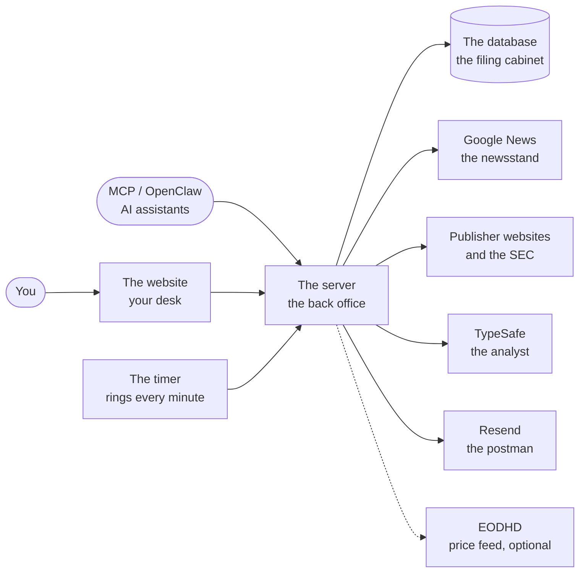
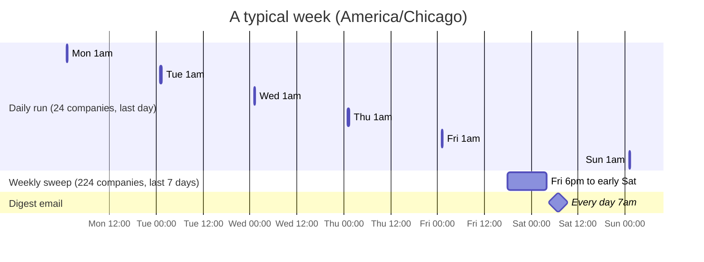
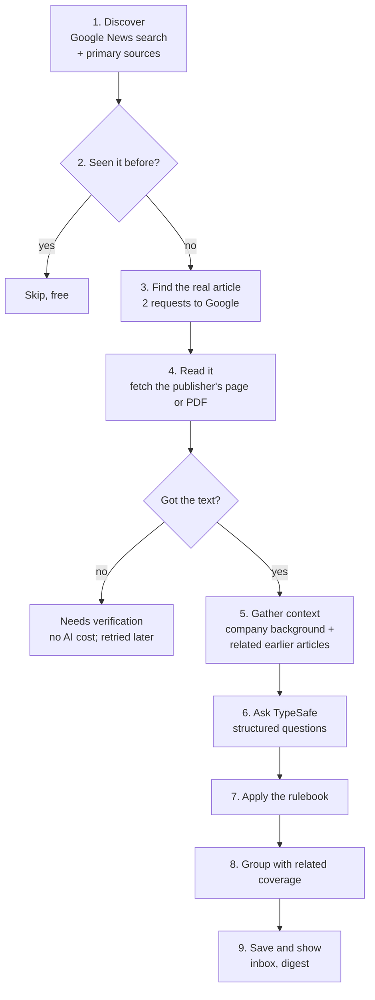
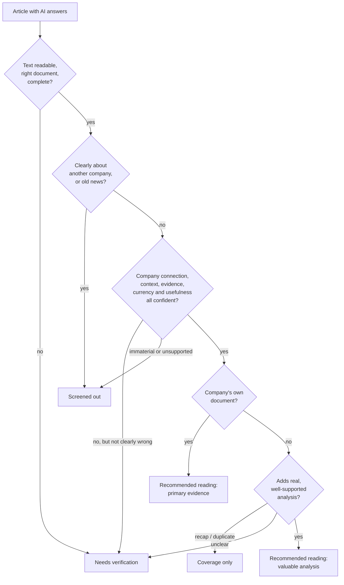

# How Research Desk works

*A plain-language guide to the whole system: what each part does, what happens every minute, night and week, how a news article becomes something in your inbox, and where to look when something seems wrong. Written for the owner, not for programmers. Last updated September 22, 2026.*

If you only read one section, read [The short version](#1-the-short-version). If you want to understand a specific behaviour, the [contents](#contents) will take you straight there. Technical detail for programmers lives in [ARCHITECTURE.md](../ARCHITECTURE.md); this guide links to it where useful but never depends on it.

---

## Contents

1. [The short version](#1-the-short-version)
2. [The cast: every part of the system and its job](#2-the-cast-every-part-of-the-system-and-its-job)
3. [A day and a week in the life of the desk](#3-a-day-and-a-week-in-the-life-of-the-desk)
4. [The journey of a single news article](#4-the-journey-of-a-single-news-article)
5. [How the AI judges an article](#5-how-the-ai-judges-an-article)
6. [The rulebook that decides where an article goes](#6-the-rulebook-that-decides-where-an-article-goes)
7. [What you see on the desk](#7-what-you-see-on-the-desk)
8. [The 7am digest email](#8-the-7am-digest-email)
9. [Price alerts](#9-price-alerts)
10. [Where your information lives, and how it is kept safe](#10-where-your-information-lives-and-how-it-is-kept-safe)
11. [Living within free limits and being a polite visitor](#11-living-within-free-limits-and-being-a-polite-visitor)
12. [Privacy and security](#12-privacy-and-security)
13. [How the parts avoid tripping over each other](#13-how-the-parts-avoid-tripping-over-each-other)
14. [When something looks wrong: a troubleshooting guide](#14-when-something-looks-wrong-a-troubleshooting-guide)
15. [The dials you can turn](#15-the-dials-you-can-turn)
16. [Your setup today, and what would improve results](#16-your-setup-today-and-what-would-improve-results)
17. [A map of the code in plain words](#17-a-map-of-the-code-in-plain-words)
18. [Glossary](#18-glossary)

---

## 1. The short version

Research Desk is a private notebook for the companies you follow, paired with a tireless research assistant that reads the news for you overnight.

You keep notes, a thesis and a status (Portfolio, Perpetual watch, Watchlist and so on) for each company. Every night at **1am Chicago time** the system searches Google News for the previous day's articles about your **most important companies** (those in your Portfolio or on Perpetual watch). Every **Friday at 6pm** it searches the **past seven days for every company** you have not paused. For each article it finds, it fetches the full text from the publisher's website, asks an AI model called **TypeSafe** a set of careful, structured questions about it, and then applies a fixed rulebook to decide whether the article is worth your time. The results land in your **News & alerts inbox**, grouped so that five articles about the same event appear as one development. At **7am** a digest email summarises what is new.

All of this happens on rented servers in the cloud. **Your computer and browser can be off.** The website is simply a window onto work that has already been done.

---

## 2. The cast: every part of the system and its job

Think of the system as a small research office. Each part has one job.

| Part | Plain description | The real thing |
| --- | --- | --- |
| **The website** | The desk you look at. It shows your companies, notes and news, and sends your edits to the server. It holds no secrets and does no research itself. | A React web app hosted on **Cloudflare Pages** at [research-desk-2p0.pages.dev](https://research-desk-2p0.pages.dev). |
| **The server** | The back office. Every real piece of work happens here: searching, reading, asking the AI, applying rules, saving results, sending email. | A single program called `desk`, running as a **Supabase Edge Function**. It runs for at most about a minute each time it is called, then stops. |
| **The database** | The filing cabinet. It holds every company, note, article, setting and piece of progress. | A **Supabase Postgres** database, project `tcfricxifanwwzgxgexj`. |
| **The timer** | An alarm clock that rings every minute and tells the server "check whether anything needs doing". Without it, nothing happens overnight. | A **pg_cron** job named `research-desk-monitor`, set to `* * * * *` (every minute). |
| **Google News** | The newsstand. It tells the system which articles exist about a company. It does not provide the article text. | Google News RSS search, the same results you would see at news.google.com. |
| **Publishers and the SEC** | Where the actual articles and filings live: Reuters, company press releases, trade magazines, SEC filings. | Ordinary public web pages and PDFs. |
| **TypeSafe** | The analyst. It never searches or browses. It reads exactly the text the server hands it and answers a fixed list of multiple-choice questions, giving its confidence in each answer. | The TypeSafe API, model `jev-1.13.0`. |
| **Resend** | The postman who delivers the 7am digest email. | The Resend email service. |
| **EODHD** | An optional price feed for automatic price alerts. **Not currently connected** for any company. | EODHD end-of-day price API. |
| **MCP and OpenClaw** | Other AI assistants that can read and update your desk through the same front door the website uses, with limited, expiring permission slips. | A local MCP server and an OpenClaw skill; see [INTEGRATIONS.md](INTEGRATIONS.md). |

Two ideas explain most of the design:

- **The server does the work in short bursts.** Cloud functions are only allowed to run for a short time and use a small amount of computing power per call (see [section 11](#11-living-within-free-limits-and-being-a-polite-visitor)). So long jobs, like searching 224 companies, are broken into many small steps. After each step the server writes down its place, like a bookmark, and the next ring of the timer carries on from there.
- **Everything that matters is written down in the database.** Progress, results and settings never live only in memory. If a step is interrupted halfway, the next step simply picks up from the last bookmark, and anything already saved is not redone or paid for twice.

---

## 3. A day and a week in the life of the desk

### Every minute

The timer rings and the server wakes up for up to about 50 seconds. It first reads a small **schedule record** (a few hundred bytes) that says what has already been done today. Then it works down a short checklist, doing only what is due:

1. **Queued jobs.** If you or an assistant asked for a specific job (for example "check this company now"), take one small step on it.
2. **The digest.** If it is 7am or later and today's email has not gone out, send it. Once sent, this is skipped for the rest of the day.
3. **The daily backup.** Once a day, save a snapshot of your research.
4. **The scheduled news run.** If a run is due, start it. If one is in progress, process up to **10 more articles** (about 45 seconds of work) and save a bookmark.
5. **Your manual news search.** If you started a search from the News page, keep it moving, even with your browser closed.
6. **Prices.** Once a night, check closing prices for companies that have a price source.
7. **Re-screens.** After the night's news run, re-examine up to **300** older articles a night that need a second look (see [below](#re-screens-second-looks-at-older-articles)).

On a quiet minute with nothing due, the whole visit costs about six tiny database reads.

### Every night at 1am: the daily run

At 1am Chicago time the server starts a **daily run** for your daily companies: everything in **Portfolio** or on **Perpetual watch**, unless you have overridden a company's frequency. There are 24 such companies today.

It asks Google News for articles published since the previous run began, with a two-hour overlap so nothing falls through the cracks at the edges. Normally that means **the last 26 hours**. For each company it runs one search per calendar day covered (usually two), keeps up to 10 results from each, and also checks any primary sources you have configured. It then reads and judges each new article, one at a time. A typical daily run finishes in a few minutes.

### After the run: prices, backup and second looks

Once the news run is done, the quieter chores happen: closing prices (for companies with a price source), the daily backup if it has not happened yet, and up to 300 re-screens.

### 7am: the digest

At 7am the digest email goes out, summarising everything discovered since the previous digest. See [section 8](#8-the-7am-digest-email).

### Every Friday at 6pm: the weekly sweep

After Friday's market close, the server starts a **weekly run** covering **every company that is not paused** (224 today), looking back **seven days**. Your daily companies go first, so the ones that matter most are finished early. After them, the others follow in alphabetical order.

This is the big job of the week: roughly 6,000 to 7,000 candidate articles, of which about half are usually new (the rest were already found by daily runs or earlier searches). At 10 articles a minute it takes several hours and is designed to finish overnight, before Saturday's 7am digest. If Google asks the server to slow down (see [section 11](#google-being-a-polite-visitor)), it will take longer, but nothing is skipped. Anything found after the digest simply appears in Sunday's.

Because the weekly sweep already covered your daily companies, **Saturday's 1am daily run is skipped**. The Sunday daily run picks up from where Friday's sweep began.

### Safety nets

- **A missed run catches up.** If the servers were down at 1am, the daily run starts at the next opportunity that day. If a Friday is missed entirely, the weekly sweep starts on Saturday, and if a whole week passes without one, it starts immediately.
- **The first night after an update** starts cleanly: the September 22 update began with the next night's daily run, and the first weekly sweep on the following Friday.

---

## 4. The journey of a single news article

This is the heart of the system. Follow one article from Google to your inbox.

### Step 1: discovery

For each company, the server asks Google News a question such as `"Kinsale" (company OR stock OR earnings OR business) after:2026-09-21 before:2026-09-22`. The extra words are only added for one-word names, to avoid articles about the town or the person. You can replace the whole search with your own wording for any company (**Monitoring → Company news search**). Progressive has a built-in special search.

Each day gets its own search, and up to **10 articles per day** are kept, in Google's own order. That means at most 20 or so per company for a daily run and 70 for a weekly run. The server also checks **primary sources**, meaning the company's own disclosures: SEC filings (built in for Netflix, Progressive, Zoom and American Coastal, or for any company with an SEC CIK number filled in), investor-relations pages, and any official RSS feeds you add.

### Step 2: have we seen it before?

Every article gets a fingerprint made from its link, title and date. If an article with that fingerprint is already stored for that company, it is skipped at once. This check costs almost nothing. It is why a weekly sweep that overlaps a daily run does not pay twice, and why an interrupted run can be resumed safely.

### Step 3: finding the real article

Google News does not give out the publisher's address directly. It gives a Google link that must be translated. The server makes **two small requests to Google** per article: one to load Google's article page, and one to ask Google which publisher page it points to. (Until September 22 this took three requests. Skipping an unnecessary redirect cut Google traffic by a third.)

### Step 4: reading the article

The server fetches the publisher's page and extracts the main text, the way a "reader mode" button does in a browser. PDFs such as SEC exhibits are read page by page. Only the first **120,000 characters** are used, which is roughly a 50-page document. Before fetching, it checks that the address is a genuine public website and not something private, and it re-checks every redirect.

Reading can fail for ordinary reasons:

- **Paywalls and "robot checks".** Some publishers block automated readers (HTTP 401/403) or show only a teaser.
- **Slow sites.** The server waits up to **8 seconds** (10 for SEC, the major news sites on its built-in list, and sources you configured), then gives up.
- **Script-only pages.** Some pages have nothing to read without running their code.

Within a run, if a publisher blocks the server or times out **twice in a row**, the server stops trying that publisher for the rest of the run. This saves time without losing anything, because those attempts would have failed anyway.

The system never tries to get around a paywall or a robot check. When text cannot be read, the article is kept and clearly labelled, and the link to the original is always there.

### Step 5: when there is no text, there is no AI call

If no real text could be read, the article goes straight to **Needs verification** with a note such as "The article body could not be verified. Open the source or retry retrieval." **No AI cost is spent** on it. The server will try reading it again the next day, up to three attempts in total, as part of the nightly re-screens.

### Step 6: gathering context and asking TypeSafe

For readable articles, the server assembles a careful briefing:

- **The company:** name, ticker, exchange, business scale, your written business context, your thesis, and the dates those were last updated.
- **The article:** its title, source, publication date, whether it is a primary source, and its text, cut into short numbered passages (`[p0]`, `[p1]`, and so on) so the AI can point to the exact sentence that supports its answer.
- **Related earlier coverage:** up to three of the company's recent stored articles that share at least two meaningful words with this headline, so the AI can tell whether this is new or a rehash.
- **A primary reference** when one exists: the company's own announcement of the same event, so a secondary article can be judged against it.

Long documents are split into sections of about 12,000 characters (up to 40 of them), read two at a time. A final "reconciliation" call then weighs the key passages from every section together, so a correction on page 30 is not ignored because page 1 looked exciting. The questions themselves are described in [section 5](#5-how-the-ai-judges-an-article).

### Step 7: the rulebook

TypeSafe's answers are probabilities, not decisions. A fixed, written rulebook in the code turns them into a verdict. See [section 6](#6-the-rulebook-that-decides-where-an-article-goes).

### Step 8: grouping related coverage

Many articles describe the same event. For each earlier article it was shown, TypeSafe says whether the new one is a **duplicate**, **added analysis**, a **later update**, or **unrelated**. Only when it is at least **85% confident** does the system link them:

- **Duplicates and added analysis** join the same development group. The group shows one lead article, preferring the company's own document, then valuable analysis, and hides the rest under "coverage".
- **Updates** (a later outcome, correction or reversal) stay separate, but are linked to the history they update.

Grouping never deletes anything. Every article remains inspectable.

### Step 9: saved and shown

The article is saved with its verdict, the reason in plain English, the exact supporting passage, and a record of how much of the document was actually read. It appears in your inbox the next time the website refreshes, and in the next digest if it qualifies. Articles judged **important** are marked as such (see [section 6](#important-developments)).

### Re-screens: second looks at older articles

Some articles deserve a second look later:

- **Unreadable articles** are retried after 24 hours, up to three attempts.
- **Your edits.** When you change a company's context, thesis, watch points or name, its stored articles are re-judged with the new context.
- **A new screening version.** When the rulebook or questions are upgraded, older judgments are refreshed. When the current version ("fundamental-v2") arrived, about 6,000 older articles were queued. At 300 a night, that backlog clears in about three weeks.

Re-screens keep your own Review, Save, Useful and Noise choices intact. They are capped at 300 a night to control AI spending. If Google pushes back while they are running, re-screens pause for 30 minutes.

---

## 5. How the AI judges an article

### Why structured questions, not a summary

The system never asks TypeSafe "is this article good?". It asks narrow, well-defined questions with fixed answer choices, and TypeSafe returns **how confident it is in each possible answer**, as probabilities that add up to 100%. For example: "attributed 82%, unsupported 11%, absent 7%". This matters for three reasons:

1. **Borderline cases stay visible.** A 55% answer is treated differently from a 95% one, so uncertain articles go to Needs verification rather than being silently accepted or discarded.
2. **The rulebook can be changed without paying again.** Because the raw answers are stored, a threshold can be adjusted and every stored article re-evaluated in code, at no AI cost.
3. **Answers are checked.** The server verifies that every answer is a permitted choice, that the probabilities add up, and that any quoted evidence passage really exists in the article. A malformed answer is treated as a processing failure, never as a verdict.

### The five core questions

| Question | What it asks, in plain words |
| --- | --- |
| **Identity** | Is this article really about this company, or about a business it is directly exposed to, such as a key customer, supplier or regulation? It judges the connection only, not whether the news matters. |
| **Significance** | How useful is this information for understanding the company's long-term value, at its size? Answered on a five-level scale (below). |
| **Support** | Is the business information attributed to something checkable (company filings, named sources, documents, data), is it unsupported opinion or rumour, or is the information simply absent from the text? |
| **Contribution** | For articles from someone other than the company: does it add original reporting or real analysis, or is it a recap of the announcement? |
| **Timeliness** | Is the information current, or an old story being recirculated? |

The significance scale:

| Level | Meaning |
| --- | --- |
| 0 | No useful business evidence: a calendar notice, share-price chatter, a name mix-up, promotion or boilerplate. |
| 1 | A real but routine event, too small to matter at this company's size. |
| 2 | Useful evidence about core financial or operating performance, including steady results and well-supported comparisons. |
| 3 | Could meaningfully change earning power, competitive position, capital allocation, management integrity or financial risk. |
| 4 | Could transform control, survival or the core business. |

### Extra questions, asked only when relevant

- **Evidence:** "Which numbered passage best supports the business development?" The passage must exist word for word in the article, which prevents invented quotations.
- **Analytical quality** (secondary articles): is the reporting or analysis adequate, weak or misleading?
- **Missing context** (when your company context is missing or older than about 18 months): would that gap change the verdict?
- **Title/body match** (when the page's own title differs from the headline): did the server read the right document?
- **Qualification** (long documents): which passage most limits or corrects the main claim?
- **Your watch points** (up to 20 per company): does this article bring real evidence about each one, and in which direction (more concerning, reassuring, mixed)?
- **Relation to earlier coverage:** duplicate, added analysis, update, or unrelated? (Used for grouping; see [step 8](#step-8-grouping-related-coverage).)

All of these are asked in **one request per article** (or per section, for long documents), so extra questions do not multiply the cost.

### What it costs

TypeSafe charges only for the text sent to it: about **$0.042 per million "tokens"** (a token is roughly three-quarters of a word). A typical article with its briefing uses about 2,500 tokens, so about **$0.0001, a hundredth of a cent**. Before every request, the server reserves the worst possible cost against your monthly ceiling, then settles it at the real amount. If the ceiling would be exceeded, the request is not sent and the article waits, clearly labelled, until the next month. See [budgets](#the-typesafe-budget).

---

## 6. The rulebook that decides where an article goes

After TypeSafe answers, a fixed set of rules (the "fundamental-v2" policy) gives each article one of five **roles**. The rules are checked in order, and the first one that applies wins.

In words:

1. **Could the article be read properly?** If the text is missing, belongs to a different document, contradicts itself without resolution, or was only partly read (for example a missing exhibit), it goes to **Needs verification**. A reading failure is never mistaken for "irrelevant".
2. **Clear rejections.** Almost certainly about another company (identity below 20%), or confidently old news (historical at least 80%): **Screened out**.
3. **Confidence checks.** The article must clear every one of these bars. Missing any one sends it to **Needs verification**, unless the answer is clearly negative, in which case it is **Screened out**:

   | Check | Bar to clear |
   | --- | --- |
   | Connection to the company | at least 80% |
   | Missing company context matters | below 50% |
   | Useful business evidence (significance level 2, 3 or 4) | at least 75% (below 20% is screened out as immaterial) |
   | Unsupported claims | below 80% (at or above is screened out) |
   | Attributed, checkable evidence, with a verified quoted passage | at least 75% |
   | Current information | current at least 70% and historical below 20% |

4. **The company's own documents** (SEC filings, the company's investor-relations site, sources you configured as official) that pass become **Recommended reading: primary evidence**.
5. **Other publishers** must also add something:
   - If it duplicates a recommended article already on file, or at least 70% "recap", it becomes **Coverage only**. The development is relevant, but this article is not the one to read.
   - If its analysis is judged misleading (at least 75%), it also becomes **Coverage only**.
   - It needs at least 70% "incremental" contribution and at least 75% "adequate" quality to become **Recommended reading: valuable analysis**. Anything in between goes to Needs verification.

### Important developments

A recommended development is marked **Important** when TypeSafe gives at least **70%** combined confidence to significance levels 3 and 4: news that could meaningfully change the business. Important items lead the digest.

### Your own judgments always win

- **Useful** overrides the rulebook and promotes an item.
- **Noise** hides a development until you undo it.
- **Review** and **Save** apply to the whole development group, even members hidden by your current filters.
- Feedback about a single source ("poor source", "duplicate", "no new information") applies only to that one article.

---

## 7. What you see on the desk

The website has five sections, in the left-hand navigation.

### Companies

Your list of companies, searchable and filterable by status, research group and text. Selecting one opens its detail panel with four tabs:

- **Research:** notes (Markdown, saved automatically as you type), thesis, status, tags, idea source, and full note history.
- **Watch points:** specific concerns you want every article checked against, for example "customer concentration with Walmart". Up to 20 per company.
- **Alerts:** numerical rules such as "tell me if the price falls below $40" or "if it drops 25% from my baseline". See [section 9](#9-price-alerts).
- **Monitoring:** how this company is checked. Frequency (automatic, daily, weekly, paused), the Google News search wording, business scale and written business context (which the AI uses to judge significance), primary sources, SEC CIK number, enabled publishers, and publishers to exclude. The status of each news source is shown here too.

### News & alerts

The inbox of developments, newest first.

- **Folders:** **Inbox** holds unreviewed, unsaved items for 30 days after discovery. **Saved** keeps items forever. **History** holds reviewed items and ones that aged out. "Return to inbox" gives an item a fresh 30 days.
- **Views:** **Relevant developments** (recommended readings), **Needs verification**, **Coverage / preferred source needed**, **Screened out / noise**, and **All events**.
- **Filters:** keyword, company, publisher, importance and publication date range.
- **Actions** on each card: Review, Save, Useful, Noise, Undo, and **Read available text**, which fetches the article text for you without any AI cost or change to the verdict.
- **The "Scheduled news runs" panel** shows the current or last nightly run (companies done, articles checked, new items, warnings), whether it is waiting because Google asked it to slow down, and a short history of recent runs.
- **Search news** lets you start your own search over the companies matching your current filters, looking back seven days with up to 10 articles per day. You can pause, resume or cancel it. It keeps running on the server even if you close the browser.

### Monitoring health

A table of every active company showing its frequency, price status, the state of each news source (last fetch succeeded, or the error), and when news was last checked. **Run a batch** queues a one-off check of prices and news for every active company, one company per minute. The nightly runs usually make this unnecessary.

### Import & backup

- **Import** your research from a Markdown file, with a preview of duplicates and ambiguous names before anything is saved. The original file is always kept. An import can be rolled back; companies you have edited since are preserved.
- **Download** the latest daily research snapshot, or a **full export** of everything (companies, notes, all articles, note history, settings).
- **Restore** from an export. This only adds missing records; it never overwrites what you have.

### Settings & digest

The digest time (7am Chicago by default), a preview of tomorrow's digest, AI usage for the month, and the **MCP & OpenClaw** permission slips (create, see and revoke), plus a history of background jobs.

### How the website stays current, cheaply

- The website keeps a copy of your articles **in the browser itself**. Opening the desk downloads only what changed since your last visit on that device. The first visit on a new device, or after three weeks away, downloads everything once.
- Every 5 seconds while the page is visible, it asks the server "has anything changed?", a tiny question. Every minute it fetches any new or changed articles.
- Company data is only re-fetched for companies that actually changed, or when you come back to the tab after 10 minutes away.
- When the tab is hidden, it stops asking.

### Your edits are never lost

- **Autosave with a safety copy.** Every change to a company is saved on your device immediately, then sent to the server a moment later. If the network drops or the tab closes, the draft is recovered next time.
- **Conflict protection.** Each record carries a version number. If something else changed the same company in the meantime (another tab, an assistant, or a nightly run), the server merges changes to different fields automatically and refuses only a genuine clash on the same field, so nothing is silently overwritten.
- **Background work never overwrites research.** Price updates and monitoring checkpoints are kept separate from your notes and thesis.
- **Note history.** Every notes and thesis change keeps the previous version.

---

## 8. The 7am digest email

Every day at 7am Chicago time (adjustable in Settings), if the digest is enabled, the server builds and sends one email:

- It covers developments **discovered since the previous digest was delivered**, not just the last 24 hours, so nothing is missed if a day is skipped.
- It includes **relevant developments**, plus uncertain ones that might be significant (flagged **NEEDS VERIFICATION**), and **monitoring alerts**.
- Developments are ordered by importance: **Important** first, then other relevant items, then verification items, with fresher news ahead of older.
- It shows the **top 20** developments, each with its company, headline, the reason it qualified, the supporting passage, a link, and how long ago it was published. It then says how many more are waiting in the inbox.
- It lists up to 10 **monitoring alerts** (for example a feed that keeps failing) and a **coverage gaps** line naming companies with a missing or failing source.

The email is sent through Resend with a unique "one per day" key, so a hiccup cannot produce two copies. You can preview the next digest at any time in Settings.

---

## 9. Price alerts

Each company can have numerical rules:

- **Price** at or below a threshold.
- **P/E** (price-to-earnings) at or below a threshold, using a positive trailing P/E of the named kind.
- **Decline** of a given percentage from a baseline price you set.

When a rule is met, you get **one alert**, not one every day. The rule then stays quiet until the price recovers past the threshold (with a small margin), which re-arms it. Changing a rule's meaning also re-arms it. Prices must be in the rule's currency, and future-dated or implausible data are rejected. A sudden jump of more than about 45% down or 80% up is treated as a possible stock split or data error: alerts are held back and you are told to check.

**Important:** automatic prices need a price source (EODHD) connected for each company, with a confirmed symbol and currency. **No company is connected today**, so rules can only use prices you enter yourself. Every company without a source produces a "No quote source configured" monitoring notice when its prices are due to be checked (daily for daily companies, weekly for the rest).

All arithmetic is done in code. The AI is never asked about prices.

---

## 10. Where your information lives, and how it is kept safe

### Everything is a "record"

The database holds everything as **records**. Each has a **kind** (what sort of thing it is), an **ID**, its **contents**, a **version number** that goes up by one on every change, and the time it last changed. The main kinds:

| Kind | What it holds |
| --- | --- |
| `company` | Everything about one company: identity, notes, thesis, status, watch points, rules, news sources, monitoring checkpoints, recent prices. |
| `event` | One article or alert: title, link, dates, the extracted text, the AI's answers, the verdict and reason, grouping, and your Review/Save/feedback. |
| `settings` | Digest time and on/off switch. |
| `revision` | An earlier version of a company's notes or thesis. |
| `import` | An original imported file and what was imported from it. |
| `backup` | A daily research snapshot (kept 30 days). |
| `news_batch` | A news run's progress: `latest` is your manual search, `scheduled` is the current nightly run. |
| `run` | Housekeeping: the scheduler's daily record (`schedule`), the re-screen queue, and the last monitoring result. |
| `article_cache` | Recently fetched article text, reused for a day (seven days if the full text was read). |
| `digest` | Which day's email was sent, and when. |
| `job`, `integration`, `request`, `audit` | Queued background jobs, assistant permission slips, and a log of what each assistant did. |

### Backups

- **Daily research snapshot** (automatic, kept 30 days): companies, notes, rules, settings and original import files. It does not include articles.
- **Full export** (on demand, from Import & backup): everything, including all articles and note history. Keep one somewhere outside the project from time to time. The daily snapshots live inside the same project, so they would not survive the project itself being deleted.
- **Restore** adds missing records and never overwrites existing ones.

### How much space it uses

On September 22 the database held about 48 MB of its 500 MB free allowance: about 7,300 articles and 247 companies. Each stored article adds roughly 5 KB.

---

## 11. Living within free limits and being a polite visitor

The system runs on free or near-free plans, each with limits. Several design choices exist only to respect them.

### Data transfer ("egress"): 5 GB a month

Supabase counts every byte that leaves the database, including bytes the server reads for its own work, against a 5 GB monthly allowance (billing cycle: the 5th to the 5th).

In September 2026 that allowance was exhausted within days. The old five-minute timer re-read **every stored article (about 18 MB), the entire daily backup, and every company** on every visit: about 5 GB a day, just to find out that there was usually nothing to do.

Since September 22 the rule is: **read only what you need, only when you need it.**

- The server reads small **summaries** of records, a few fields each, when it is scanning, and fetches full records only for the handful it will actually work on.
- Existence checks ("is there already a backup today?", "have we seen this article?") read nothing but the record's ID.
- Heavy chores happen **once a night**, not every minute.
- The website keeps its own copy of your articles and asks only for changes.

Measured results: a quiet minute now reads about **370 bytes**. A news run reads about **28 KB per new article**. Expected total: **roughly 0.7 to 0.8 GB a month**, comfortably inside 5 GB. The detailed rules for future changes are in [ARCHITECTURE.md](../ARCHITECTURE.md#egress-and-resource-budgets).

### Server time and computing power

Each server visit may last at most 150 seconds, with only about **2 seconds of actual processor time**. Waiting on the network does not count; reading and parsing web pages does. Reading one article costs about 80 milliseconds of processor time, so each minute's visit handles at most **10 articles** (about half the allowance) and stops after about 45 seconds. This is why a weekly sweep takes hours, and why that is fine.

### The TypeSafe budget

The AI's monthly spending ceiling is set on the server (currently **$5**; the code will not allow more than $10). Expected spending is about **$3 a month**: roughly $1.60 for weekly sweeps, $0.30 for daily runs and $1 for re-screens. Usage for the calendar month appears in Settings. TypeSafe's own invoice is the final word.

### Google: being a polite visitor

Google tolerates automated news searches but pushes back on anything that looks like a flood. It replies "too many requests" (HTTP **429**) or "service unavailable" (**503**). Cloud servers share addresses with many other programs, so Google is stricter with them. On September 20 to 22, about **9 in 10** article lookups from the server were refused.

The system now behaves like a courteous visitor:

- **It spaces requests out:** at least 2 seconds between searches and 0.6 seconds between article lookups.
- **It backs off when refused.** It waits **1, then 3, 10, 20 and 30 minutes** before retrying the same step. The progress panel shows "Google News asked us to slow down; resuming around …".
- **It learns.** Each refusal doubles the spacing (up to 20 seconds between searches and 10 between lookups). Each success eases it back by 5%. The learned pace is saved with the run, so the next minute does not start fast again.
- **It does not throw work away.** A refused search or article is retried later rather than recorded as a failure. Only after **five refusals in a row** on the same step does the run move on: a search is reported as a warning and skipped, and an article is saved as unreadable, to be retried the next night. One stubborn step cannot stall the whole run.

If Google stays strict, runs are slower. The system prefers finishing late to hammering Google or filling your inbox with unread articles.

### Publishers

As described in [step 4](#step-4-reading-the-article): an 8-second timeout (10 for SEC, major news sites and configured sources), and a publisher that blocks the server or times out twice in a row is skipped for the rest of that run.

---

## 12. Privacy and security

- **Only you can sign in.** Sign-in is by email link only, and only for `nithin@mantena.com`. Public sign-up is disabled. There is no password to steal.
- **Secrets never reach the browser.** The TypeSafe key, the email key and the database master key live only on the server. The website carries only public identifiers that grant nothing on their own.
- **The timer has its own secret.** The scheduled endpoint accepts only the timer's credential, stored in Supabase's encrypted vault, and never a browser session.
- **Assistants get limited permission slips.** MCP and OpenClaw use credentials that are shown once, stored only as a scrambled fingerprint, expire on a date you choose, can be revoked instantly, and carry only the permissions you tick. Starting work that spends AI budget is a separate permission. Every assistant action is recorded in an audit log.
- **The database refuses direct edits.** Tables are locked so that only the server's checked functions can write, and each owner can only ever read their own records.
- **Article text is treated as untrusted.** The AI is told explicitly that article text is evidence, never instructions. Fetching refuses private network addresses and checks every redirect. Nothing tries to bypass paywalls or robot checks.
- **The website is locked to its own address.** The server refuses requests from web pages other than the desk itself.

---

## 13. How the parts avoid tripping over each other

Several things can happen at once: the timer ringing, you editing a company, an assistant adding a note, your manual search running. Three simple mechanisms keep them from colliding.

- **"Reserved" signs (leases).** Before starting a piece of work, a worker places a sign in the database, such as "article X is being screened" or "the nightly run is being advanced", with an expiry time. Anyone else who sees the sign leaves that work alone. The sign is removed when the work finishes, and if a worker crashes, the sign expires on its own (after 5 minutes for a run, 10 for an article), so work is delayed, never lost. This is what prevents the same article from being paid for twice.
- **Version numbers.** Every save says "I am changing version 7". If the record has meanwhile become version 8, the save is refused and the change is merged or retried. Nothing is silently overwritten.
- **Bookmarks.** Long jobs record exactly where they are: which company, which search, which articles are queued. Progress is saved every few steps. After an interruption, at most those few steps are redone, and anything already saved is skipped by the "seen it before" check.

---

## 14. When something looks wrong: a troubleshooting guide

| What you notice | What it usually means | Where to look / what to do |
| --- | --- | --- |
| Most new articles are in **Needs verification** with "could not be verified" | The article text could not be read: paywall, robot check, slow site, or Google refusing the lookup. No AI money was spent on them. | Open a few. If the reason mentions HTTP 429/503, Google was pushing back; they will be retried the next night. "Read available text" retries one on demand. |
| The Scheduled news runs panel says **"resuming around …"** | Google asked the server to slow down; it is waiting as it should. | Nothing to do. It resumes automatically. |
| A run shows **warnings** | A source failed after retries, for example an investor-relations page blocking automated reads (HTTP 403), or a search refused five times. | Expand the warnings in the panel. A permanently failing source can be removed or replaced in the company's Monitoring tab. |
| **"Monitoring needs attention"** items in the inbox or digest | A company's source failed during a run, or it has no price source. | The message names the source. See the company's Monitoring tab. |
| A company never gets any news | Its search wording finds nothing, often a spelling difference (the "Deckers Outdoors" versus "Deckers Outdoor" case), or a name shared with something else. | Monitoring tab → Company news search. Try the search at news.google.com first. |
| No digest this morning | The digest is off, email delivery is not configured, or it already went out earlier. | Settings & digest → preview. The `digest` record shows what was sent and when. |
| Items marked **"TypeSafe budget unavailable or reached"** | The monthly AI ceiling was reached. | They wait, labelled, and are re-screened once the new month starts. Usage is shown in Settings. |
| The desk feels stale | The browser only refreshes while the tab is visible. | Switch back to the tab, or reload. |
| You suspect the server has stopped | The timer or the server may be failing. | Ask for a check of the timer's recent answers (the `net._http_response` table: each minute should show status 200) and of the `run/schedule` record. |
| Worried about data transfer | Something may be reading too much. | Supabase dashboard → Usage → Egress. The database's query statistics (`pg_stat_statements`) show which reads run most often. |

---

## 15. The dials you can turn

### From the website, no code needed

| Dial | Where | Effect |
| --- | --- | --- |
| Company status (Portfolio, Perpetual watch, Watchlist, …) | Research tab | Portfolio and Perpetual watch make a company **daily**; everything else is **weekly**. |
| Monitoring frequency | Monitoring tab | Override automatic: daily, weekly or **paused**. Paused companies are left out of all runs. |
| Company news search | Monitoring tab | Replace the automatic Google search wording. |
| Business scale and context | Monitoring tab | Tells the AI how big the company is and what matters to it. **The biggest lever on screening quality.** |
| Primary sources, SEC CIK, official feeds | Monitoring tab | Adds the company's own disclosures, which can become recommended primary readings. |
| Enabled and excluded publishers | Monitoring tab | Allow additional publisher sites to be read; hide publishers you never want. |
| Watch points | Watch points tab | Every article is checked against each one. |
| Price rules | Alerts tab | Numerical alerts (automatic prices need a price source). |
| Digest on/off and hour | Settings & digest | When the daily email arrives. |
| Assistant permissions | Settings & digest | Create, limit and revoke MCP/OpenClaw access. |

### In the code, for a developer

| Dial | File | Current value |
| --- | --- | --- |
| Daily run hour, weekly day and hour, overlap, articles per minute, re-screens per night | `supabase/functions/_shared/constants.ts` → `NEWS_SCHEDULE` | 1am; Friday 6pm; 2 hours; 10; 300 |
| Articles kept per search per day | `news-batch.ts` → `articleLimit` | 10 |
| Google spacing and back-off | `fetch-policy.ts`, `news-batch.ts` (`THROTTLE_DELAYS`) | 2 s / 0.6 s; 1, 3, 10, 20, 30 minutes |
| Publisher timeout, host-skip rule | `article-content.ts`, `fetch-policy.ts` | 8 s (10 s configured/SEC); 2 failures |
| Rulebook thresholds | `fundamental-policy.ts` | See [section 6](#6-the-rulebook-that-decides-where-an-article-goes) |
| AI questions | `screening-prompts.ts`, `news-screening.ts` | Version `fundamental-core-2.0.0` |
| Inbox age limit | `event-inbox.ts` → `INBOX_DAYS` | 30 days |
| Digest size | `jobs.ts` → `DIGEST_DEVELOPMENT_LIMIT` | 20 |

### Server settings (Supabase Edge Function secrets)

`TYPESAFE_MONTHLY_BUDGET_USD` (AI ceiling, at most 10), `TYPESAFE_MODEL` (pinned `jev-1.13.0`), `ALLOWED_FEED_HOSTS` and `ALLOWED_ARTICLE_HOSTS` (extra permitted sites), `ALLOW_PUBLIC_ARTICLE_HOSTS` (set `false` to read only listed sites), `ENABLE_EMAIL_DELIVERY`, `RESEND_API_KEY`, `DIGEST_FROM`, `DIGEST_TO`, `EODHD_API_KEY`. Changing these is described in [DEPLOYMENT.md](../DEPLOYMENT.md).

---

## 16. Your setup today, and what would improve results

A snapshot from September 22, 2026:

| | Today |
| --- | --- |
| Companies | 247: 24 daily, 200 weekly, 23 paused |
| With business context written | 2 |
| With watch points | 0 |
| With primary sources, SEC CIK or official feeds | 0 (Netflix, Progressive, Zoom and American Coastal have built-in SEC/IR discovery) |
| With a price source | 0 |
| Digest | Enabled and delivering at 7am |
| AI ceiling | $5 a month ($1.15 used in September before the change) |

What would make the biggest difference, roughly in order:

1. **Write business context and scale for your daily companies.** Without it, the AI is asked whether the missing context matters, and when it says yes the article goes to Needs verification instead of being judged. A few sentences per company ("mid-size specialty insurer; E&S lines are ~80% of premium; key risk is catastrophe exposure in Florida") go a long way.
2. **Add primary sources for important companies:** an SEC CIK number for US filers, or the investor-relations news page or RSS feed. The company's own documents are the most reliable path to Recommended reading, and they avoid Google entirely.
3. **Add watch points** for the specific risks and catalysts you care about.
4. **Check the news search wording** for companies that rarely produce news, and for one-word or ambiguous names.
5. **Connect prices** if you want automatic price alerts. Otherwise, "No quote source configured" notices will keep appearing.

---

## 17. A map of the code in plain words

| Where | What lives there |
| --- | --- |
| `src/main.tsx` | The website: sign-in, navigation, company editor, autosave, settings, import screens, monitoring table. |
| `src/news-panel.tsx` | The News & alerts screen: folders, views, filters, cards, the scheduled-run and search-progress panels. |
| `src/news-cache.ts` | The browser's own copy of your articles, so opening the desk downloads only changes. |
| `src/drafts.ts` | The on-device safety copy of unsaved company edits. |
| `src/sync.ts`, `src/api.ts` | Merging fresh data into the screen safely, and talking to the server. |
| `supabase/functions/desk/index.ts` | The server's front door: checks who is calling (you, an assistant, or the timer). |
| `supabase/functions/_shared/scheduler.ts` | The minute-by-minute checklist: decides when daily and weekly runs, prices, backups, re-screens and the digest happen. |
| `supabase/functions/_shared/news-batch.ts` | The run engine: works through companies, searches and articles in small steps with bookmarks, back-off and warnings. Used by both nightly runs and your manual searches. |
| `supabase/functions/_shared/jobs.ts` | Processing one article end to end, re-screens, price checks, daily backup, and building and sending the digest. |
| `supabase/functions/_shared/article-content.ts` | Finding and reading articles: Google link translation, publisher fetching, safety checks, text extraction, SEC and investor-relations discovery. |
| `supabase/functions/_shared/fetch-policy.ts` | Politeness rules: Google spacing and slow-down, recognising "too many requests", skipping publishers that block. |
| `supabase/functions/_shared/providers.ts` | Reading RSS news feeds and the price feed; configuration. |
| `supabase/functions/_shared/news-screening.ts` | Preparing the briefing for TypeSafe, sending it, checking its answers, and handling long documents. |
| `supabase/functions/_shared/screening-prompts.ts` | The exact wording of the five core questions. |
| `supabase/functions/_shared/fundamental-policy.ts` | The rulebook (section 6). |
| `supabase/functions/_shared/screening-policy.ts` | Grouping duplicates, choosing the lead article, digest ordering, and compatibility with older judgments. |
| `supabase/functions/_shared/news.ts` | Google search wording, cleaning up article text, and which view an article belongs in. |
| `supabase/functions/_shared/engine.ts` | Daily/weekly schedule arithmetic, Chicago time, price-rule arithmetic. |
| `supabase/functions/_shared/event-inbox.ts` | Inbox, Saved and History rules. |
| `supabase/functions/_shared/api.ts`, `api-v1.ts` | Every request the website and assistants can make, with permission checks. |
| `supabase/functions/_shared/model.ts` | The shape of a company, an article and a record. |
| `supabase/functions/_shared/supabase-store.ts`, `server/store.ts` | The filing clerk: reading and writing records in the cloud database, or in a local file when running on your computer. |
| `supabase/functions/_shared/constants.ts` | Statuses, default settings, and the nightly schedule (`NEWS_SCHEDULE`). |
| `supabase/migrations/` | The database's structure and its guarded write functions. |
| `client/`, `mcp/`, `bot/`, `openclaw/` | How AI assistants connect, using the same operations as the website. |
| `tests/` | 223 automated checks, run with `npm test`. |
| `scripts/` | Maintenance, diagnostics and one-off tools. Some make paid AI calls; read before running. |

---

## 18. Glossary

- **Article role:** the rulebook's verdict for one article: primary reading, analytical addition (valuable analysis), coverage only, needs verification, or rejected.
- **Back-off:** waiting progressively longer before retrying after a "too many requests" reply.
- **Cadence:** how often a company is checked. Daily companies are in the 1am run; everyone not paused is in the Friday sweep.
- **Coverage:** other articles about the same development, grouped under the lead article.
- **Development:** one real-world event, however many articles describe it.
- **Digest:** the 7am email.
- **Edge Function:** a small cloud program that runs briefly when called. Here, the server.
- **Egress:** data leaving the database; limited to 5 GB a month on the free plan.
- **HTTP 403 / 429 / 503:** a website saying "forbidden", "too many requests" and "temporarily unavailable".
- **Lease:** a temporary "reserved" sign that stops two workers doing the same job.
- **Primary source:** the company's own disclosure or a regulator's document, such as an SEC filing or investor-relations release.
- **Probability / confidence:** how sure TypeSafe is of each possible answer, from 0% to 100%.
- **Re-screen:** judging a stored article again, after a failed read, a context change or a new rulebook version.
- **RSS:** a simple machine-readable news list; Google News search results come in this format.
- **Run:** one pass of news searching over a list of companies (the daily run, the weekly sweep, or your manual search).
- **Snapshot:** the automatic daily backup of your research.
- **Tick:** one ring of the minute timer, and the work the server does in response.
- **Token:** the unit TypeSafe charges by; roughly three-quarters of a word.
- **TypeSafe:** the AI service that answers the structured questions about each article.
- **Version number:** a counter on each record that prevents one save from silently overwriting another.
